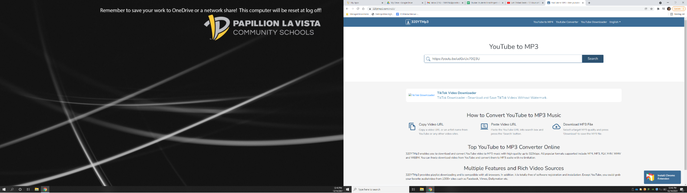

## [→ Click to View Subsections ←](headers-h.ndtjbu9g0o6e)

Premiere Pro
============

Common Setup
------------

\[TODO\]:

Basic Editing Techniques
------------------------

\[TODO\]:

What’s a keyframe?
------------------

\[TODO\]:

Installing a Preset into Premiere
---------------------------------

*   Install desired preset off of Google
*   Move download into PLV Media>Video Copilot Downloads>Premiere Presets
*   Unzip the file and create a new folder with all of its contents
*   Open Premiere
*   Go the the Effects tab
*   Right-click on the folder with a star named “Presets” and select ‘Import Presets’
*   Go to PLV Media>Video Copilot Downloads>Premiere Presets>\[Preset Folder\]
*   Select the PRFPSET File and click Open

Multicam Setup
--------------

### About

In this section of Premiere Pro, you will explore how to effortlessly sync together multiple camera angles of one take. Instead of trying to sync audio tracks to one another by hand, multicam does it for you. Multicam Source Sequencing is the best way to create diversity in your project with different camera angles. In the server under PLV Media>PLVMediaGuide>Premiere Pro>Multicam Setup you can practice and follow along within the premiere project.

### Creating the Multicam Sequence

Before you even begin editing, remember to set up a clap, or a sync, when filming to make life much easier. This would be something along the lines of “Song 1 Take 1.” Now, you can begin editing. First, you have to open up your premiere project and place your clips into the bottom left box. It is suggested that you utilize bins to keep track of the clips that go together to avoid any confusion. Next, go through your clips to find your desired take. Once you are satisfied with all of your clips, this is where you highlight all of the clips, or angles, you want synced. Now that the clips you want to sync together are highlighted, right click and find “Create Multi-Camera Source Sequence…” If your right click does not work, do command space and search “mouse.” Make sure to enable right click. Once you have selected “Create Multi-Camera Source Sequence…” a window will appear. Make sure “Audio,” “Track Channel: Mix Down,” “Sequence Preset: Automatic,” and “Enumerate Cameras” are all selected. Refer to the picture below to double check all settings. After you click OK, the multicam sequence will become one clip and show up in the bin in the bottom left box. Drag the multicam clip into your sequence. In order to switch camera angles you can either right click, and find “Cameras,” or you can click the numbers up at the top of your keyboard. If the audio does not appear in the sequence at first, remove it, and place it back in again. You now have successfully created a multicam sequence.

Adding Music (Outside of Storyblocks)
-------------------------------------

*   Open Google/Safari
*   Go to Youtube
*   Look for ‘Copyright free’ music that fits your theme on Youtube
*   Copy the link to the music of your choice
*   Open a new tab
*   Search ‘youtube to mp3 converter’
*   Find the first link that works
*   Paste the Youtube link into the converter and click Okay or Convert
*   Download the mp3
*   Move the file from ‘Downloads’ to your folder in the server
*   Import the music into your premiere project

