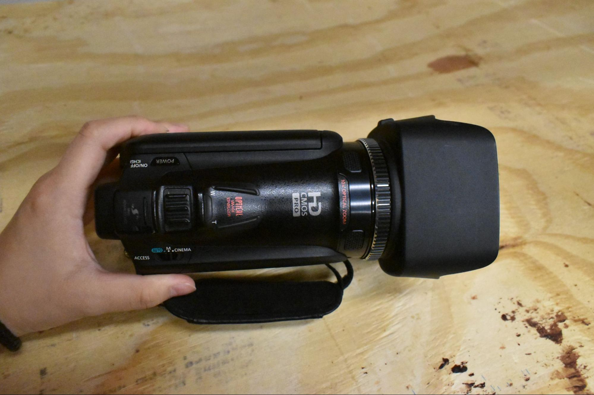

## [→ Click to View Subsections ←](headers-h.7bmai9pwkh9p)

Cameras
=======

Cameras do not all use the same batteries. Each camera and battery is color coded. Its power cable is also color coded. Some items are interchangeable and will have multiple colors on them.

\[TODO:\]

*   Photos and descriptors of each camera and battery and charger—call out how that camera is visually different (XA25 record button is red, body is wider; batteries are clearly marked)

Canon
-----

### Vixia

This camera’s battery color is red.

#### Formatting media

*   the Vixia calls formatting initializing - different words for the same thing. ALWAYS choose COMPLETE INITIALIZATION. It will help to protect your SD card from failure.
*   the XA10 calls formatting initializing - different words for the same thing. ALWAYS choose COMPLETE INITIALIZATION. It will help to protect your SD card from failure.

Tap FUNC in the upper left corner of the screen.

Now tap MENU in the upper left corner of the screen.

The menu will open onto the camera settings. Tap on the WRENCH tab.

Scroll down to the INITIALIZE option and tap the orange box.

Tap INITIALIZE.

Tap both COMPLETE INITIALIZATION and YES.

Be patient.

Tap okay and you are ready to go!

*   Note that these need a 3.5mm to XLR cable for external mic

### XA10

This camera’s battery color is red.

Appearance wise, the XA10 seems identical to the XA35. The difference is that it is smaller, and a lighter body.

#### Formatting media

Tap FUNC in the upper left corner of the screen.

Now tap MENU in the upper left corner of the screen.

The menu will open onto the camera settings. Tap on the WRENCH tab.

Scroll down to the INITIALIZE option and tap the orange box.

Choose the slot in which you put your SD card.

Tap INITIALIZE.

Tap both COMPLETE INITIALIZATION and YES.

Be patient.

### XA25

This camera battery’s color is yellow.

Appearance wise, the XA25 seems identical to the XA10. The difference is the thicker, larger, heavier body.

### how to format (initialize) media in XA25

Tap FUNC in the upper left corner of the screen.

Now tap MENU in the upper left corner of the screen.

The menu will open onto the camera settings. Tap on the MEDIA tab.

Scroll down to the INITIALIZE option and tap the orange box.

Choose the slot in which you put your SD card.

Tap INITIALIZE.

Tap both COMPLETE INITIALIZATION and YES.

Be patient.

### XF305

\[TODO:\]

*   Note that this camera needs a different memory card available for checkout from Hoch

JVC
---

We use JVC cameras primarily for streams.

### Setup

[JVC Camera and Manfroto Streaming Tripod instructions](https://www.google.com/url?q=https://docs.google.com/document/d/1tEeGrExoEoM0UwCHkSWTLOjBPLeZc--sqhEDyHGrvYc/edit?usp%3Dsharing&sa=D&source=editors&ust=1662057758149616&usg=AOvVaw1R8kr5tEVWJvWbSCg9umV0)

### Common Issues

#### My SDI isn’t outputting! My Display won’t show anything!

This is almost always a problem with the output settings. You can change them by doing:

*   Main Menu -> A/V Set \-> Video Set \-> HDMI/SDI Out \-> HDMI+SDI

All menu buttons are on the left side of the screen.

DSLR

DSLR (Nikon D5600)

This camera is primarily used for photos. We also use this camera for glamour shots, and hype video footage.

* * *