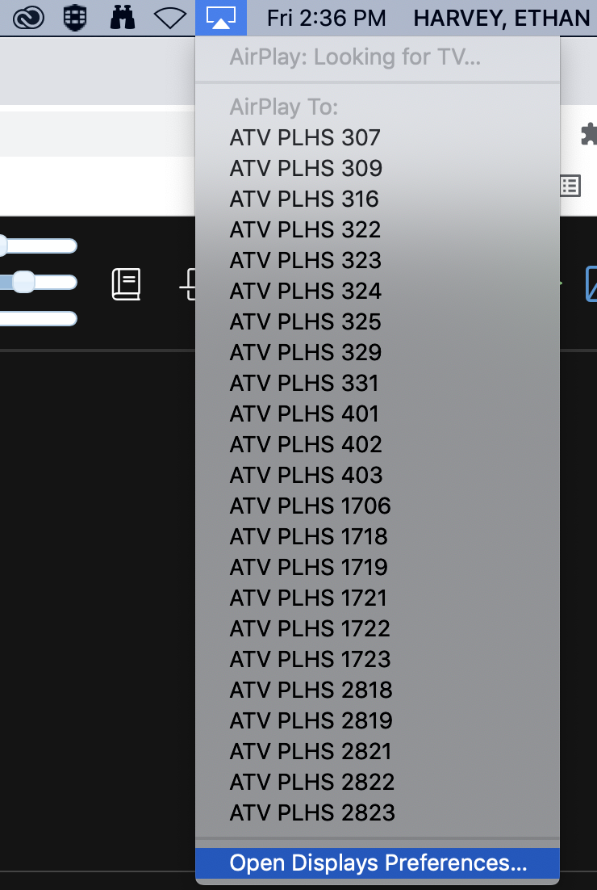
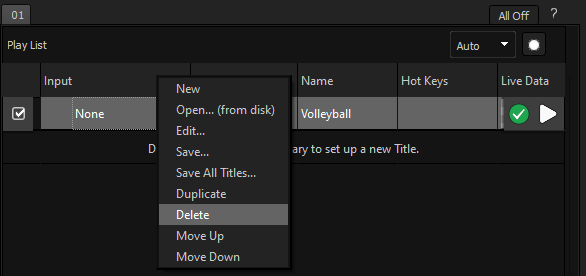

## [Click to View Subsections](headers-h.mp2wk13ytfu)

Scorevision Video Boards (Gymnasiums)
=====================================

Web Interface
-------------

The web interface is where you can add, sort, and prepare media to be shown, configure board settings, and add games. Log in at [app.scorevision.com](https://www.google.com/url?q=https://app.scorevision.com/&sa=D&source=editors&ust=1648236501116366&usg=AOvVaw2Icvt7O9zgs8YWZftayD1_).

### Changing/Adding New Seasons

Enter ScoreVison, click on the Games and Events tab, click “Add/ View all seasons” under Other Options. At the top of the  screen there should be an “Add New Season” option and select the relevant sport.  

### Adding Teams

First thing after you log into Scorevision is to go over to the left-hand side panel and click on “Games & Events”, which will open a drop down. Then click on “Change Season” before you do anything else because the one that opens up automatically usually isn’t the team you want to be working with, you will want to click on the right team before you start doing anything else.

When you click on “Change Season” it will open another small window which has all of the teams.

After you click on the correct team it will come up with two options for you to click on, and there are two ways to create new teams. You can either click on “Manage Teams” on the main portion of the screen or you can click on “Teams” over on the left-hand panel (like shown below).

From here it will show you all of the teams that have been created. Click on “Add Team” and then it will open up a new window where you will input all of the team’s information.

There are 7 things you will need to enter, as shown above: My Team, Name, Short Name, Team Logo, Team Color, Gender, and Grade.

First you will have to say whether or not it is your team (which it will only be your team if it is Monarchs in the Monarch account or Titans in the Titan account). Then you will put in the team’s Name and Short name (which is the team’s mascot). Next upload the team’s logo (this you will find on the server by going to PLV Media>Logos and then from their you can click on either high school in our district or if you are looking for an opposing team’s logo you would then click on High Schools and continue from there to find the correct logo).

Next you will need the Team’s color. There is a spreadsheet on google classroom under the Media Academy classroom; go under “Video Boards -> Resources -> Opponent SM & Colors” to find the hex codes that you can copy and paste right into Scorevision. Then you will select the gender and grade. Grade is either Varsity, JV, Reserve, or 9. After that click save and you’re done.

### Adding Rosters

Once again there are a couple of ways in which you can add a team's roster into ScoreVision. The first way is by making sure you are in the season you want and being in the TEAMS panel, click “EDIT” on the team you want, then you can manually input each and every player by clicking on “ADD PLAYER”. Clicking on this would open up another window that will ask for the players first name, last name, and number. Once you put all of that information in, click save, and then repeat the process. You can also click “add another” instead if you are adding in a whole team.

The second way to import a roster is by using the excel spreadsheet that ScoreVision puts on their website. You can also find this spreadsheet by going to the server “Video Boards->ScoreVison->Rosters->Template\_Roster\_Import”. This is the template so make sure that you “save as” after putting in the roster so that other people can use the template after you. In this template all you have to do is follow the format of the spreadsheet by putting in the first name, then last name, then number in the same row. Then “save as” with the document name as School Name\_Level\_Sport. You can save this in that same roster folder that you found the template.

Then to put this into ScoreVision you need to be in the same location as stated above, after you click “edit team”, instead of clicking add player, click on “Import Roster”. This will open another pop-up and you will click “Import Roster” again which will bring up the server and you can find the roster that you made. Then all you have to do is click open and it automatically inserts all of the players into that team.

Either way works, it is just nicer if opposing schools play both Monarchs and Titans, then you can import the premade roster spreadsheet into both schools' ScoreVision accounts without having to manually input every player into both schools’ accounts. It’s really up to you though.

### Adding and Configuring Media (Video)

There are 3 main steps to getting a video on the board: uploading, adding to a collection, and displaying that collection. This system can get fairly confusing, but is powerful if you utilize it right.

To upload media, navigate to the “media” panel

Once that opens up, under the category “Upload Media” you’ll see “Media Library.”

This page contains a bunch of media groups. The group system can be confusing, but just think of it as a folder where you’re putting the media. Either add to an existing group by choosing edit, or make a new one if you need.

If you’re uploading a video, use the top option—1920x1080 Cinema—and just select add media. This can take awhile, don’t panic.

Now, you need to go to “Media -> Organize Media -> On Demand Collections”

These are the groupings that will appear in the Producer app, as-is.

Either select one to edit, or make a new one. To add media (it must be in a group, as detailed above), select the group it’s in and drag it over. Ensure that you click save.

Finally, you have to display this collection in the producer app.

To do this, go to “Media -> Assign Media -> Media Defaults”

The top panel, “On-Demand and Playlist Media Defaults,” is what controls the collections displayed in the producer app. You can either remove the existing collections from being shown (“delete” does not delete the collection! It just makes it no longer display), or you can add your own collection.

Note: you must go to the hamburger menu in the producer app and select “Download Media” for it to update!

### Adding games

\[TODO:\] (also include mhsaa and maxpreps information)

Operation (ScoreVision Producer App)
------------------------------------

\[TODO:\]