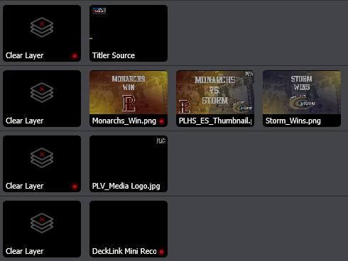
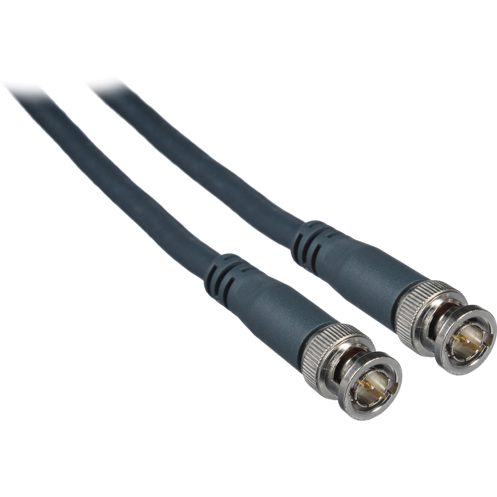
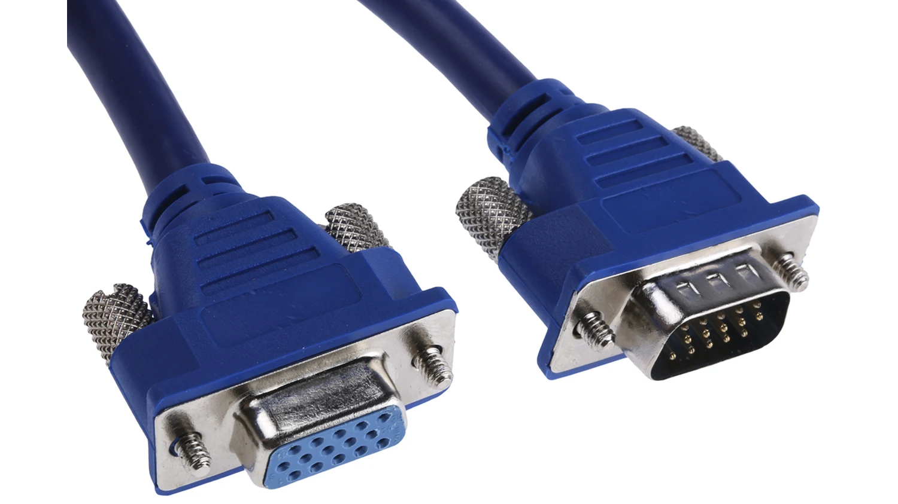
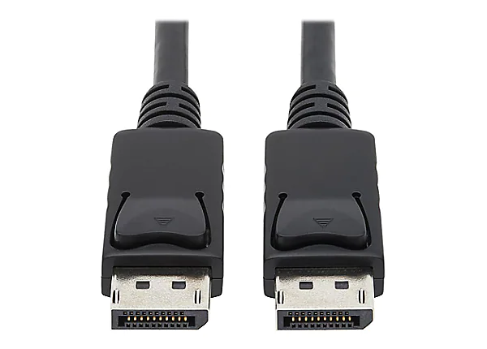
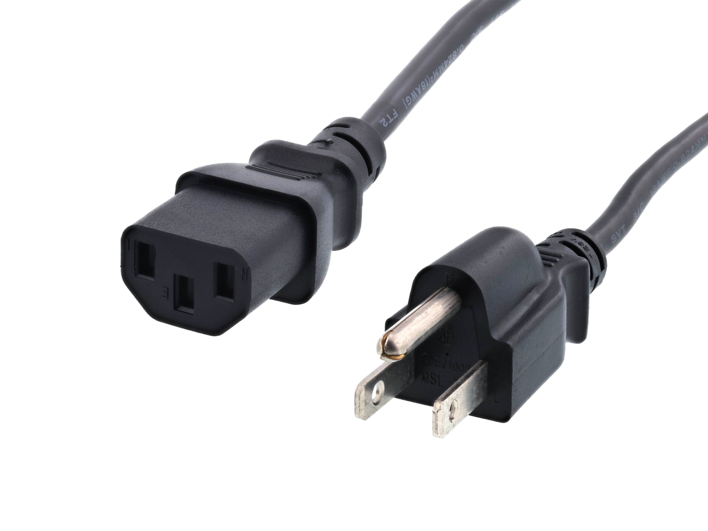

## [→ Click to View Subsections ←](headers-h.fglkqcvgontl)

Cables
======

Cable Maintenance
-----------------

### Re-Ending SDI

Our tools look slightly different, but the process is the same as is shown in [this video](https://www.google.com/url?q=https://www.youtube.com/watch?v%3D6gbKZBT0n-0&sa=D&source=editors&ust=1662057758234699&usg=AOvVaw00gBeRllgFQt9eErQcf_3j).

### Re-Ending Ethernet (CAT5/CAT6)

Our process isn’t the exact same, but you can follow [this tutorial](https://www.google.com/url?q=https://youtu.be/RSUazDcLVWo?t%3D34&sa=D&source=editors&ust=1662057758235052&usg=AOvVaw2wovHF7SNJCy33BPGcszBs) to get the gist. The main difference is that we use a different tool, but it’s similar enough. Also, the wire diagram is on the tool, just use that.

Cable Types
-----------

### Video Cables

#### HDMI

HDMI cables connect cameras with monitors and computers with monitors. HDMI transmits video and audio but does not transmit power. HDMI signal quality is limited and cannot be used over long distances. Without a signal booster HDMI should not be used over about 12 feet.

#### BNC

#### 

BNC refers to the special locking end that is on SDI cable. We use BNC to refer to the entire cable itself as shorthand. The cable connects cameras with the switcher and the switcher with the streaming computer. It is used any time audio and video need to be transmitted over long distances. There are limits without a signal booster but several hundred feet of transmission is fine without a booster.

#### F-Type SDI

This SDI is the same cable as BNC, but without the special locking end. It functions in exactly the same way. refer to BNC for more details.

#### VGA

VGA is used to connect a computer with a display. It transmits standard definition video only. It is rarely used anymore but we do have some monitors that need it for connection.

#### DisplayPort

Display port is used to connect a computer with a display. It is a secure, locking cable that works only with PC. A monitor must be known to have this connection port. Display port transmits high definition video and audio.

### Audio Cables

#### Auxiliary (AUX)

Note: 6.35mm is often called quarter-inch

We most commonly use quarter-inch and 3.5mm jacks. The 3.5mm is the “standard” small aux cable.

#### XLR

XLR stands for eXtremely Long Run. It transmits audio and only very low voltage power (enough to power a microphone and no more). It is used to connect a camera with a microphone or an audio mixer with a microphone.

### Camera Power Cables

\[TODO:\]

### Other Power Cables

#### Monitor Power

Technically called a C13 cord, but nobody ever calls it that.

Sometimes it’ll get called “wall power” or something similar, too.

### Data Cables

#### USB Types

The primary USB connector types are below. There is also a designation between versions, such as USB 3.0 connectors being colored blue on the inside, but for the most part this

difference does not affect us - if it does, just look for the blue USB 3.0.

### Network Cables

#### Ethernet (CAT5 and CAT6)

For our purposes, there’s almost never a real difference between CAT5 and CAT6. They’re interoperable and have the same connector.

The difference is just max-rated speed and power, due to some cable internals. Effectively, don’t worry about it.

#### Thunderbolt 2 → Ethernet (Dongle)

We only really use this to connect the Switcher → MOAC/BOAC

