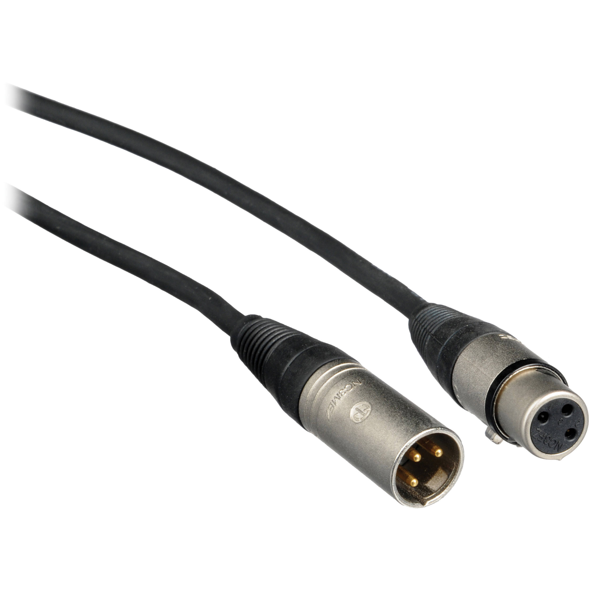
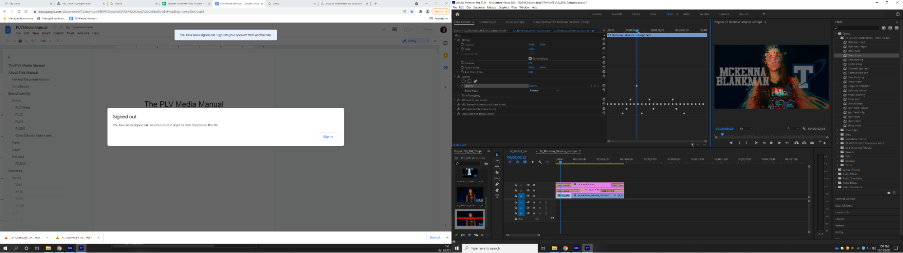
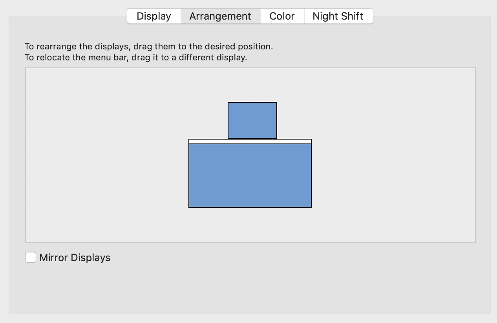
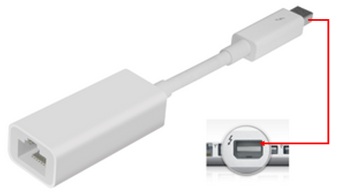

## [Click to View Subsections](headers-h.fglkqcvgontl)

Cables
======

Cable Maintenance
-----------------

### Re-Ending SDI

\[TODO:\]

### Re-Ending Ethernet (CAT5/CAT6)

Our process isn’t the exact same, but you can follow [this tutorial](https://www.google.com/url?q=https://youtu.be/RSUazDcLVWo?t%3D34&sa=D&source=editors&ust=1650573219024901&usg=AOvVaw3G0NYfxMjduyN1TObnsTZb) to get the gist.

Cable Types
-----------

### Video Cables

#### HDMI

#### BNC

#### 

#### F-Type SDI

#### VGA

#### DisplayPort

### Audio Cables

#### Auxiliary (AUX)

Note: 6.35mm is often called quarter-inch

#### XLR

### Camera Power Cables

\[TODO:\]

### Other Power Cables

#### Monitor Power

Technically called a C13 cord, but nobody ever calls it that.

Sometimes it’ll get called “wall power” or something similar, too.

### Data Cables

#### USB Types

The primary USB connector types are below. There is also a designation between versions, such as USB 3.0 connectors being colored blue on the inside, but for the most part this

difference does not affect us - if it does, just look for the blue USB 3.0.

### Network Cables

#### Ethernet (CAT5 and CAT6)

For our purposes, there’s almost never a real difference between CAT5 and CAT6. They’re interoperable and have the same connector.

The difference is just max-rated speed and power, due to some cable internals. Effectively, don’t worry about it.

#### Thunderbolt 2 → Ethernet (Dongle)

