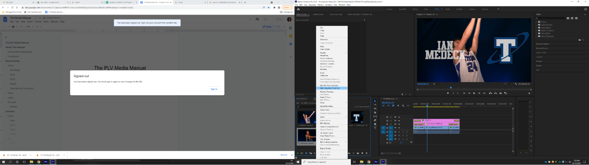
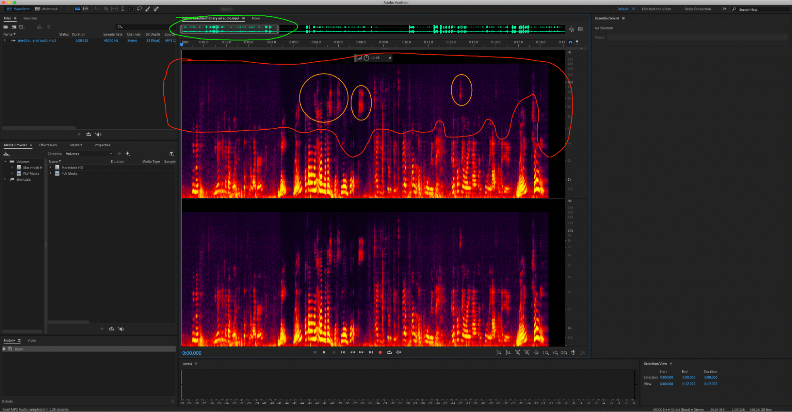

## [→ Click to View Subsections ←](headers-h.fglkqcvgontl)

Cables
======

Cable Maintenance
-----------------

### Re-Ending SDI

Our tools look slightly different, but the process is the same as is shown in [this video](https://www.google.com/url?q=https://www.youtube.com/watch?v%3D6gbKZBT0n-0&sa=D&source=editors&ust=1650922382379438&usg=AOvVaw3KDOT636QHyRjqY6T_9V5c).

### Re-Ending Ethernet (CAT5/CAT6)

Our process isn’t the exact same, but you can follow [this tutorial](https://www.google.com/url?q=https://youtu.be/RSUazDcLVWo?t%3D34&sa=D&source=editors&ust=1650922382380206&usg=AOvVaw3K5AmkAix7b6pk7xj7_Ggt) to get the gist. The main difference is that we use a different tool, but it’s similar enough. Also, the wire diagram is on the tool, just use that.

Cable Types
-----------

### Video Cables

#### HDMI

#### BNC

#### 

#### F-Type SDI

#### VGA

#### DisplayPort

### Audio Cables

#### Auxiliary (AUX)

Note: 6.35mm is often called quarter-inch

We most commonly use quarter-inch and 3.5mm jacks. The 3.5mm is the “standard” small aux cable.

#### XLR

### Camera Power Cables

\[TODO:\]

### Other Power Cables

#### Monitor Power

Technically called a C13 cord, but nobody ever calls it that.

Sometimes it’ll get called “wall power” or something similar, too.

### Data Cables

#### USB Types

The primary USB connector types are below. There is also a designation between versions, such as USB 3.0 connectors being colored blue on the inside, but for the most part this

difference does not affect us - if it does, just look for the blue USB 3.0.

### Network Cables

#### Ethernet (CAT5 and CAT6)

For our purposes, there’s almost never a real difference between CAT5 and CAT6. They’re interoperable and have the same connector.

The difference is just max-rated speed and power, due to some cable internals. Effectively, don’t worry about it.

#### Thunderbolt 2 → Ethernet (Dongle)

We only really use this to connect the Switcher → MOAC/BOAC

