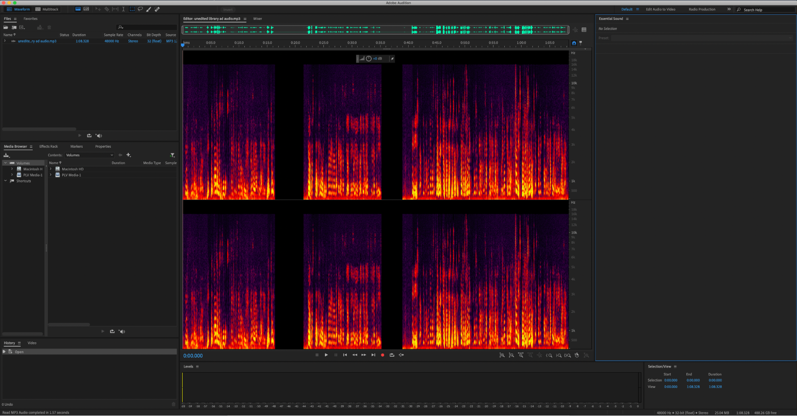
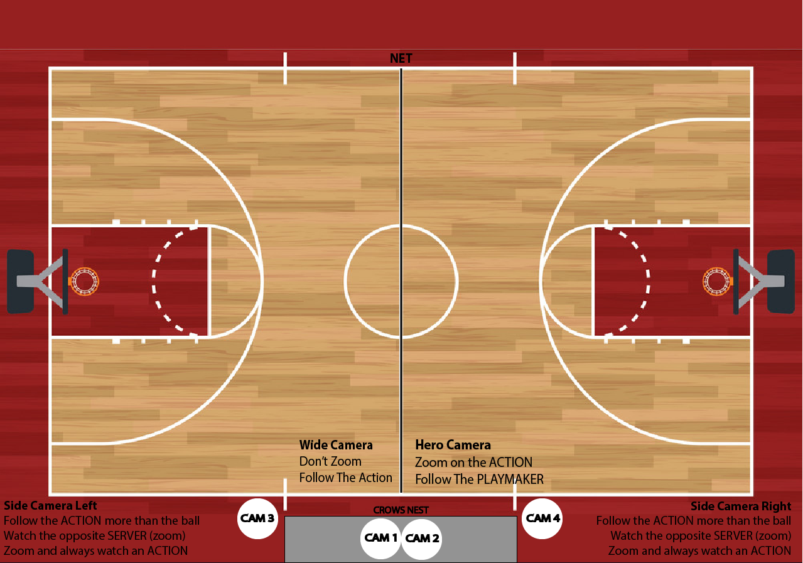
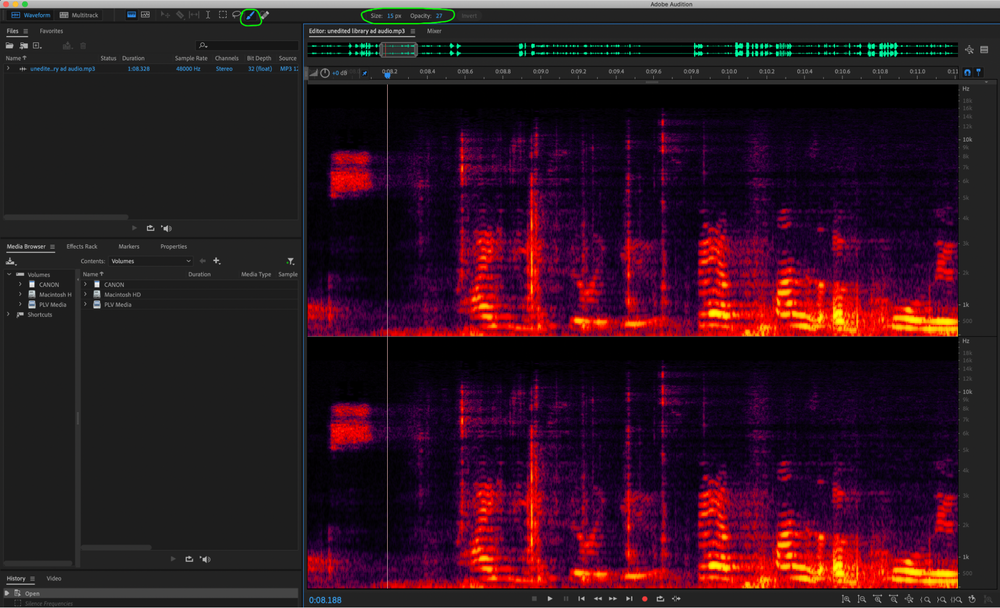

## [→ Click to View Subsections ←](headers-h.t3tpiexa8wjk)

Audio
=====

Formats
-------

.wav

.mp3

.ogg

.aac

AIF, AIFF, AIFC

.sesx

Audition
--------

Audition is our main audio editing software. You can fix basic things like audio levels and crossfade in Premiere Pro, but for more complex things such as removing background noise or audio artifacts, you’ll need Audition.

Basics

Like most Adobe programs, you can open a video or audio file by dragging it into the Audition interface or right clicking the file and hit Open with > Adobe Audition.

Audition will open like this first screenshot. This black window with the green lines is the waveform window. You really don’t need the waveform window, it just shows you how loud the audio is by how tall the waves are. (You can zoom in to see the individual waves better if you’re curious)

The spectral display window- which is the purple, orange, and yellow colored one- can too, based on color (black is silent, yellow is loudest), but it also shows other things such as audio artifacts and where certain sounds are coming from pitch-wise.

Again, you don't need the waveform, so drag up these three dots at the bottom of the window to see the spectral display. Zoom in/out by squishing/expanding this gray box on top. You can move it to the specific selection of audio you want to edit.

\[TODO\]\*add tutorial on basic tools\*

Getting Rid of Unwanted Audio

The red and orange bubbles are bits of audio you don’t want. Unwanted sounds (circled in orange), such as a school bell ringing, are called audio artifacts. Background noises (circled in red), such as a fan in the background, are also called artifacts, but for the sake of understanding, I’ll just call these general sounds background noises. Getting rid of them is pretty easy, it might just take a while.

-----------------------

### Background Noise

First, let’s get rid of the air conditioning sounds in the background. Select a rectangle of just background audio. It’ll just look like grainy purple. Make sure your selection includes ALL pitches (from the bottom to the top of color) otherwise it’ll just get rid of all high- or low-pitched background noise. I recommend recording “nothing” in the space you’re filming to ensure that you have enough background noise to capture a noise print. Just a few seconds should be enough.

Then go to Effects > Noise Reduction/Restoration > Capture Noise Print. This makes a blueprint of what background noise looks like so Audition can get rid of it in other places. In order to get rid of all background noise in a selection, click two times in the colored box. In order to get rid of all the background noise in the whole audio clip, click three times.

After you’ve selected the clip you’d like to fix, go to Effects > Noise Reduction/Restoration > Noise Reduction (process).

A window will pop up where you can edit how much unwanted audio you reduce. Honestly, I don’t really know what the difference is between the “noise reduction” and the “reduce by” sliders is, but I know that it’s better to mess with the “reduce by” slider first, then the “noise reduction” slider. Just mess with the sliders until it sounds the best. There’s also this blue line that you can adjust. In this clip, Mikee and Meredith are talking. Meredith has a higher pitched voice and is talking quieter. Mikee has a lower pitched voice and is talking louder. To equalize them, I’m going to move the right side of the blue line up to make higher pitches (Meredith’s voice) louder.

### Audio Artifacts

Now that you’ve got background noise taken care of, we can get rid of audio artifacts. In this screenshot, there’s a keyboard clicking in the background (circled in red). We’re going to get rid of it using the marker up top circled in green.

First, you want to make sure that you know you’re erasing what you want to erase. Select where the audio artifact is, then listen to that selection. Keep listening and moving the borders of that selection in until you’ve selected nothing but the artifact. This is how you know where to erase.

Drag in the sides of the gray box to zoom into your artifact so you can more accurately erase what you need to. Select the paintbrush tool. ONLY use the paintbrush tool for erasing artifacts, the spot healing tool isn’t as precise. Make sure to adjust the size and opacity of your brush. Note that the brush opacity on Audition maxes out at 50. This doesn’t mean that 50 is 50% opacity, but rather 100%, So, for example, 25 = 50% for some reason. Now you can erase the artifacts. I like to reduce the brush opacity to ~30 since there are different levels of “opacity” in the spectral display. That “opacity”- I’m not sure how else to describe it- is the same thing as loudness and again, is visualized by a spectrum of black (silent) -> yellow (loudest).

### Getting Rid of Echoes

Select all of your clip by clicking three times. Go to Effects > Noise Reduction/Restoration > DeReverb. If you go into Effects > Delay and Echo that will just add more echo! Unless you’re working on a personal project that requires this effect, you always want to get rid of any echo that’s present. There will be a window that pops up, similar to when you’re getting rid of background noise.

First, you want to select which frequencies that have the most echo. You only really need the first two buttons. The first focuses on all frequencies, and the second focuses on lower frequencies. It depends on your audio clip which button you need. Then, go to the reduction amount slider. Mess around with it until it sounds the best it can. Also, to the right of this window is an optional gain adjuster. I’ve never come across a situation in which

### Adding Effects

\[TODO:\]

Premiere Pro (Audio Info Only)
------------------------------

\[TODO:\]