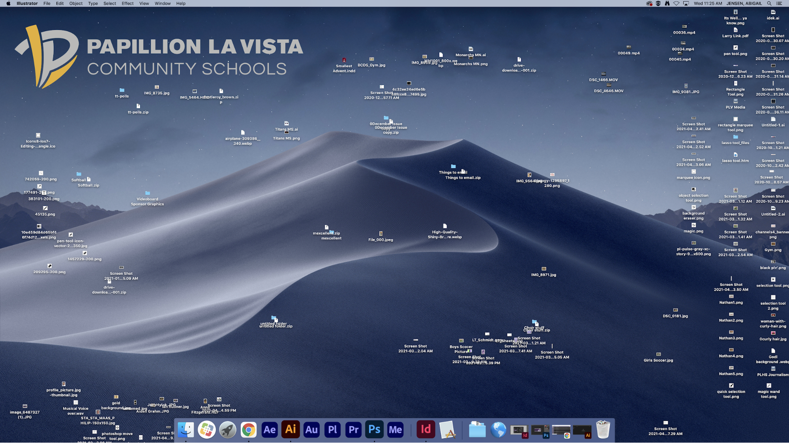

## [→ Click to View Subsections ←](headers-h.deagn8ol99gl)

The Server
==========

To keep our projects organized, clean, and easily shareable, we make use of a centralized server.

You should never keep files on your desktop—if it’s important enough to have, it’s important enough to keep saved on the server.

If your desktop looks like this, you’re doing it wrong @Abigail Jensen

Connecting to the Server
------------------------

### Mac

*   Click the Earth logo in the taskbar.

### PC

*   Should already be connected, just open the M drive.

### Stadium

*   Should already be connected, under //media

Etiquette & Rules
-----------------

The server makes sharing and collaboration super easy for us, but like all good things, it comes with some required trust and etiquette.

Always make sure to:

*   Try to keep your file sizes small, when possible. We only have so much space.
    *   Delete files when no longer needed (only ever delete your own! You don’t know if someone needs something else)
*   Keep your folders organized, in an easy-to-understand structure.
*   Always descriptively name your files. “untitled-project(500).prproj” is never a good name for a file.
*   Only move your own files around. If you need a copy of something, you can copy it. Never move someone else’s files around without permission.

Staying Organized
-----------------

Everybody has their own preferred organizational structure, and you can generally keep whatever structure you want in your own folder (as long as it’s neat!). However, when working on a more collaborative project, make sure to ask the project’s manager/leader how they want everything laid out! Any (decent) system can work, as long as you stay consistent between everyone. Consistency is key!