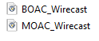
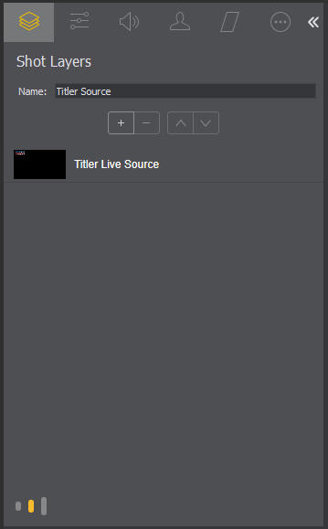
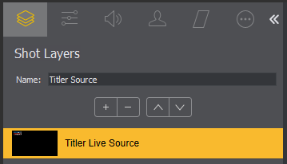
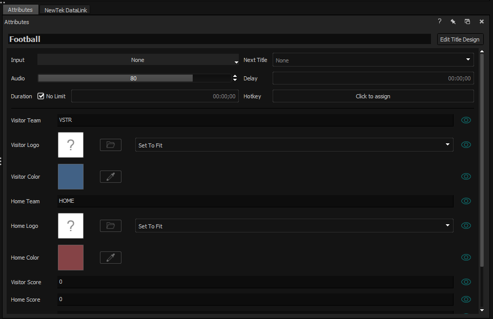
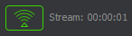
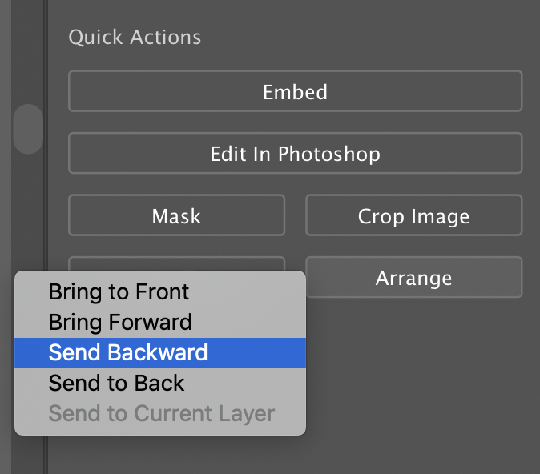
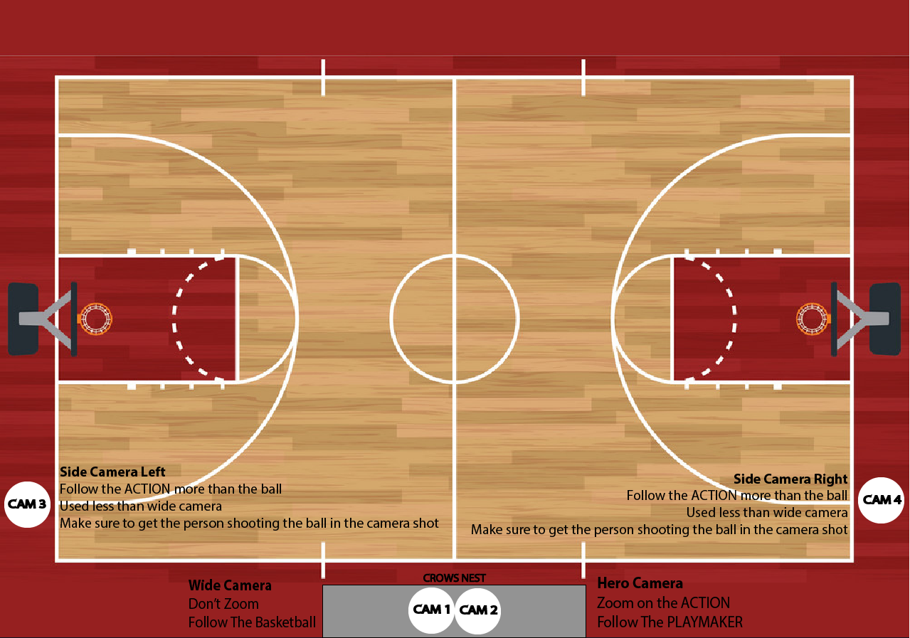

## [→ Click to View Subsections ←](headers-h.f4nxr635jhly)

Live Streaming
==============

Crew Roles
----------

### Uniforms

Unless specified otherwise for a specific stream, your required uniform is:

*   Black pants or black/khaki shorts that come to your knees
*   A PLV Media uniform shirt and or PLV Media sweatshirt/jacket

We want our name/logo to be seen so that we can go wherever we need to without people questioning who we are or if we are where we are supposed to be. It is a really big convenience and also helps people to see who we are and what organization we are a part of and can help with recruitment and getting our name out there. Of course each year, it is up to the production students to determine if they want to keep this uniform as it was or if they want to make any changes to it.

### [Producer](h.k6vpdgk5q6kp#producing)

See [\[Producing\]](h.k6vpdgk5q6kp#producing).

### Tech Director (TD)

\[TODO\]:

### Switcher

See: [Switcher Operation](h.saa8t5379qfj#operation)

### Replay

This role is responsible for setting up the equipment, prepping it for the stream, operating it during the stream, downloading the highlights at the end of the stream, and proper shutdown and storage of the equipment. A specific guide to operation can be found here.

It is critical to remain in clear communication with the TD throughout the stream so that replays can be played in a timely manner (hopefully after each major play in FB).

### GFX/Wirecast

This section is for during-stream operation instructions of the software wirecast. For what you need to connect to the wirecast hardware/computer, see either the [MOAC Setup](h.saa8t5379qfj#setting-up-in-practice) or [BOAC Setup](h.kwhq4y8y0apo) sections. For more technical details or making a new template/title, see [MOAC - Wirecast](h.saa8t5379qfj#wirecast).

#### Starting Wirecast & Titler Live

Navigate to the server by opening up File Explorer, going to “This PC” in the sidebar, and choosing the PLV Media (M:) drive. Then, go to Wirecast Files.

You will see either BOAC\_Wirecast or MOAC\_Wirecast. Use the appropriate one by double clicking it.

Once it opens, you will see 4 primary layers. They are as follows:

*   Titler Source. (scores, down, etc.)
*   Thumbnail/Graphics
*   PLV Media Logo Bug
*   Video Input (From Switcher)

You will have to delete everything currently in layer #2 (assuming it was left over from a previous stream), and put in the graphics for whichever stream you happen to be doing. To add new graphics, hover over the layer. A plus button will appear. Click that, and on the leftmost side select “media files.” Double-click “browse disk,” find the graphic(s) you want to insert. And click open.

To show something, click on it. (e.g. Monarchs\_Win.png). To hide it, click the “Clear Layer” button (leftmost side of each layer).

Initially, it will only go to Preview, the left-hand video stream. To push the Preview view to the Live view, press the ➨○ button.(ctrl+g on windows)

Now, you have to set up titler. Click on Titler Source in layer #1.

Something like this should show up on the left-hand side of the screen. (Or, if you have a different looking page, keep reading until it looks familiar.)

If it looks like this:

Double click on the arrows >> to open the view panel.

Click on Titler Live Source.

Click on the three dots ··· (The rightmost option, as shown selected above)

Click on the big “Titler Live” button. (It’s thinner on MOAC, but still there).

Titler should open up. If the title for the game you’re already using is there—rejoice! Otherwise:

Delete the title currently there (if one exists, there may not). (Right click on the title).

Right click, select Open… (from disk).

Navigate to The Server -> Wirecast Files -> Titler\_Files, and open the title for the game you’re doing.

Now, there should be an “attributes” panel that shows up. If you don’t see it, go to the topbar, View -> Attributes.

Set up all the stuff for your game. (Note: Logos for other teams are most likely in The Server -> Logos -> High Schools -> Class A High Schools)

\[TODO: PLACEHOLDER INSTRUCTIONS - WORK IN PROGRESS\]

While using the Attributes folder is great for changing the colors, team names, and logos, it will NOT be used for streaming during the game.

Instead, you will use the scoreboard tool for whatever sport you are streaming.

To access the scoreboard tool, you go to the top bar and click Inputs-> Sports-> Scoreboard Tool-> \[TODO: Fix This\] (or smth like that IDK IM DOING IT FROM MEMORY SORRY) and then select the sport. For softball, use the baseball option.

If your Inputs button is greyed out, your Titler file is probably live. To take it off live, press the red arrow next to your design in the Playlist area (it will be a white arrow when not live). Then you can access the Inputs panel! Good job! (Note: by saying “live” I dont mean that you are LIVESTREAMING just that Titler is actively sending the source to Wirecast.)

Specific Sport Instructions

Most everything with the scoreboard tool is intuitive, which makes sense considering its whole purpose is to make things easy!!

*   FOOTBALL: \[TODO:\]
*   VOLLEYBALL:
*   SOFTBALL:

If the scoreboard tool isn’t sending information to the actual scoreboard (aka it’s not working)...

*   Cry
*   Go into Edit Title Design, or right click on your design in the playlist. This will open a new Titler window. You cannot be live while you edit your design
*   This is where you edit the makeup of your scoreboards! This is where we created them and add new features, all stuff that we’ll add to the guide eventually. For now, you’ll focus on whats already there.
*   Click on any text/shape that SHOULD be changing when you input things in the scoreboard tool (for example, the home score or the quarter)
*   This will open a little section with a whole lot of settings. You’re going to find the tab that says “Global”
*   In Global, scroll down to the section that says Text Variable. There should be a little box checked. If not, check it.
*   With the box checked, you will be given two option boxes for where the variable is connected to and what its name is. If the one of the left reads “None” then you just found the problem!
*   Click on that option box and scroll down until you find “Scoreboard Tool: \[Sport\]” (Note: it won’t actually say \[Sport\], it’ll be the name of various sports. Choose the one you’re working on. duh)
*   Next click on the righthand option box and scroll until you find the correct output for what text/shape you selected (for example it might say Visitor Score). It might have already done it for you because sometimes the program decides to be smart.
*   All other variable elements should have automatically updated to the new output but just to be sure, check all other elements and make sure they’re sending out to the correct scoreboard tool under the correct name
*   SAVE!!! Clicking the green checkmark will automatically save and exit from the window.
*   If none of that worked…
*   Cry (loudly)

#### Wirecast Output Settings (Youtube) & Starting the Stream

##### Regular Setup

If you are using the “MOAC\_Wirecast” or “BOAC\_Wirecast” templates, you shouldn’t have to set up the output settings manually in wirecast. Otherwise, reference [WC Settings](h.k6vpdgk5q6kp#wc-settings) below.

However, you still need to set up the stream title and thumbnail. To do so:

*   Log into the PLV Media Youtube Channel
    *   Ask Hoch or a student who knows the login to do this for you.
*   On the top bar, select “Create -> Go Live”

*   Select “Edit”
*   From here, you can set the stream title, and the thumbnail (scroll down).
*   Also, on the side bar on the menu that comes up, select “Monetization” and turn it on (for all types).
*   Click Save

Now your stream is set up. When you are ready to GO LIVE, for the world to see, go back to Wirecast, near the top, and select this button.

If all is well in the world, it should turn green, and the stream is now live!

(If all is not well with the world, your network is likely not yet connected. It can take a few minutes after you plug in the ethernet for it to connect. If you have waited a few minutes and it still hasn’t connected, restart the computer.)

##### WC Settings

Add an RTMP Server, and use these settings:

(If the exact encoding option is not available, use the first one you see with 1080p30)

You can get the stream key from the same youtube page as detailed in [Regular Setup](h.k6vpdgk5q6kp#regular-setup).

#### Template Requirements

Fall

*   Football
    *   Teams, team logos, scores, time-outs, down & distance, ball on, clock, penalty indicator, sponsor logo (on left or right side)
*   Softball
    *   Teams, logos, runs, hits, errors, balls, strikes, pitch count,
*   Volleyball
    *   Teams, logos, scores, sets, match score, game score, clock (sometimes)

Winter

*   Basketball
    *   Teams, logos, scores, quarter, fouls, clock, bonus
*   Wrestling
    *   Teams, logos, individual score, weight, period, sponsor logo AND extra scoreboard with just team score (total)

Spring

*   Soccer
    *   Teams, logos, scores, half, sponsor logo, pk shootout (separate thing with dots green for score red for miss/block)
*   Baseball
    *   Teams, logos, scores, inning, hits. runs. errors, pitch count sponsor logo

#### Stream GFX Creation

*   GFX Needed: Thumbnail (Every Sport we stream), “\[Team\] Won” (Every Sport we stream, Halftime (Football), Weather Delay (Any Outside Sport)
*   ##### Thumbnail
    
    *   Needs: Both team logos, both team names in athletic font with white grunge, need team colors (Refer to the spreadsheet), need background photo, need white grunge png, need “V.S.” in athletic font and white grunge, “PLV Media” logo.
    *   Where?: PLV Media>StreamGFX>Football>Template
    *    
    *   For a monarch home game use “DSC\_0046.jpeg”
    *   For titan home games use “Foundation\_footballs.jpeg”
    *   Right Click photo and hover over “Open With” and choose “Adobe Illustrator”
    *   
    *   Fit the image to the frame by moving the corner of the image to the black outline of the artboard.
    *   Drag in “better white grunge.png”. Where? StreamGFX>Football>Template>Photos
    *   Fit “better white grunge.png” in the art board the same way you did with the first image.
    *   Select the Grunge image and on the right side of the screen select “Arrange” and select “Send Backward”
    *   
    *   Select the top image and go to opacity and bring opacity down to 75%
    *    
    *   Drag in each team logo and name

### Camera Operator

\[TODO:\]

### Camera Spotter

\[TODO:\]

### Commentator(s)

#### Pre-Season

*   Pre-season is very important because if done correctly, sets you up for the rest of the season. During this time is when all the research needs to be done; Learn the coaching staff, rosters, expected key players, positions, overall expectations, where seniors are looking/committing for school, etc. This is very easy stuff to talk about on-stream because it is indisputable and nice facts people enjoy to hear. This stuff is not very difficult to do and makes life easier when the season starts.

#### During Season

*   Once the season has begun, it's time to release your inner statistician. Well, stat finder more so. The most reliable place is MaxPreps ([https://www.maxpreps.com](https://www.google.com/url?q=https://www.maxpreps.com&sa=D&source=editors&ust=1662057758191076&usg=AOvVaw1FSx8sNTSxDJONf_pfIqi4)). Here you can find all the stats for all the sports. On a day-to-day basis it is really important to follow the in-season teams for both schools.

5 CRUCIAL stats for each sport:

Football: Offense - TD, Total yards, Yards per “attempt”, Yards per game, Total points

                   Defense - Total tackles, Tackles per game, Tackles for loss, Sacks Takeaways          (interceptions or fumbles)

        Basketball: Points per game, Assists per game, Rebounds per game, Blocks per game, Steals per game

        Volleyball: Kills, Kills per set, Aces, Service errors, Blocks

#### Post-Season

*   Once the season has ended for a particular sport, there is not really anything that needs to be done, as your attention turns to the next in-season sport.

#### Pre-Stream

*   The first thing that needs to be done once the van is unpacked, is to set up the Commentator mic, mute, and monitor (See pic below). This is very important to get done as soon as possible so you can; help everyone else with stream setup, and more importantly make sure your audio is working and properly leveled, and if not it has plenty of time to get fixed.

#### During Stream

*   During the stream is when you commentate the game. For football/volleyball, you need to play-by-play as the ball is in play. In between snaps/serves, and/or stoppage of play is when you can integrate the stats that you have collected. Basketball is a different story; since the ball is in play much more, you will need to integrate the stats while the ball is live, and not constantly call the play-by-play. This will require you to have more knowledge of your stats and be able to weave them in as they apply.

#### Post-Stream

*   Your job post stream is very simple, you get all of the commentator stuff packed up and put away as soon as the stream has ended. Once your job is done you ask the producer what can be done to help get everything cleaned up and put away.

Producing
---------

\[TODO: Create a general guide for FB, volleyball, SB/BB, wrestling, basketball, soccer, track

Include physical set-up diagram for each location; where to stage and store cases while streaming; order to set up/tear down; things to prepare in advance; packing list (if different for your sport than the usual set up); crew assignment considerations\]

### Creating Live Streams (on Youtube)

\[TODO:\]

### Football

These are probably the most extravagant streams we do based on the time involved, the size of crew needed and that kind of stuff, but I would also argue that these are the funnest streams!

#### Note: (& this goes for producing ANY stream)

The first (and possibly most important) thing to note when you are going to produce football games (or any live streams) is that problems are going to come up and that’s ok. No one expects you to be perfect. Now I know this is a manual and this isn’t really an instruction but it is important as a producer to know that every stream is not going to be perfect. It’d be great if it was but that is not realistic, and that’s ok. What is important is how you handle the situation and adapt to the problems that may arise. But in the end make sure you have fun, that’s what this academy is about and if you as the producer aren’t having a good time then that will affect you and your team as well. Trust yourself, and enjoy it.

#### Crew

Training crew takes place at the scrimmage games that both high schools have. This is a great time to have as close to a game experience without all of the pressure of being live and having an actual audience. It also helps you and your crew feel more comfortable about the upcoming season and streams. What we have done in the past is break up the studies kids into groups with a production member leading them around. Take them down onto the field to show them where the roaming cam will be at (if it is used), go up in the press box onto both decks and the booth so that they can get a more general idea of where things are and how set up should look. This night is also a great time to start building relationships between production and studies kids. We all remember what it was like to be in their position and have no idea what to do or what to expect, so building those relationships early on can help bring your crew together and make the year go by a lot smoother and a lot more fun.

There are 13 positions to fill at a football stream, including you as the producer. You can use this [crew assignment sheet](https://www.google.com/url?q=https://docs.google.com/document/d/1doFWHWDPeLHgkT0VobISPC9Nunav_cPnoaojwMRd-mc/edit?usp%3Dsharing&sa=D&source=editors&ust=1662057758193575&usg=AOvVaw3o90AiXUQjw_eKlRkPNbWf) to fill out everyone's positions for the game. Those positions are cams 1-5 (and 2 spotters for roaming cam), wirecast/gfx, spotter for GFX and video board, director, switcher, replay, and then producer of course (14/15 if you include commentator(s)). It is important to know everyone on your crew to be able to fit them with the right jobs to help the stream run as smoothly as possible. It is also important as the season goes on, to train people in different positions so that you don’t have only one person who knows how to do replay. Because if they are gone you don’t want to have to be calling them to fix stuff for you. You will also want to switch people around during the game that way they aren’t doing the same thing for the entire game. Makes the time go by a little faster for everyone and is more fun.

When considering who to put in what positions, you have to think about a couple of things...

#### Pre-Stream

The very very very first thing to do when producing a stream is [create the video](h.k6vpdgk5q6kp#creating-live-streams-on-youtube) on the PLV Media YouTube page so that when you go into restream.io later the video is already made and you just have to click on it. This can be done as soon as you find out that you are producing, then you don’t have to worry about forgetting it later. Before you head over to the stadium you also have to make the [crew assignment sheet](https://www.google.com/url?q=https://docs.google.com/document/d/1doFWHWDPeLHgkT0VobISPC9Nunav_cPnoaojwMRd-mc/edit?usp%3Dsharing&sa=D&source=editors&ust=1662057758194150&usg=AOvVaw18pjJ7enFFE_rRVPrYy_Sd). It’s best to do this on the day of the stream because you might have some cancellations or some switching around of people working so I wouldn’t recommend doing it until the day of. I would recommend doing it the day of in class. When you get to the stadium you can tape this paper up on the PLV Media booth door that way everyone can see the jobs they will be doing during the stream. Another thing you will want to do before you leave the school is get in contact with the video board producer and ask them to print you off a script. This script has everything that is happening and at what times for the entire night. This is extremely useful during the stream and can help you know if there is stuff added during pre-game or halftime like homecoming court, or senior night, for example. This information also helps you know when you will need to start the stream.

Something else you need to do before the stream is ask your gfx designer to make some gfx for the game. You’ll want a thumbnail to put up at the beginning of the stream, a halftime gfx, and a “\_\_\_ wins” for each team since you can’t predict the future and know which team you will need it for. Please please please ask the gfx designers well in advance that way they don’t have to rush and get things done, like 3-4 days ahead of time. It’s just common courtesy.  You’ll also want some kind of lower third gfx for the dance team, NJROTC, P-Town twirlers, and the band so that you can put those up when they are performing and on the field. These can be generic though for each school and used at each game instead of making a new one each time. There are some made in the Other folder that you can use or you can make new ones instead, it’s up to you. When they have made the gfx you’ll want to put them in the StreamGFX-->Football (and then you can make subfolders here for each individual game) folder on the PLV Media server. I highly recommend putting everything you need for the stream in that folder. That way when you get to the stadium everything you need is in one spot and you don’t have to go searching for it.

So before you leave the media room...

*   Make the stream on YouTube
*   Ask your gfx designer to make the gfx for the game (Make sure that they actually get done, because people are busy and mistakes happen so double check that they are done. Don’t just assume that they are, because if they aren’t done it’s easier to fix before you leave the school.)
*   Fill out the crew assignment sheet
*   Make sure all of your crew is there and in [uniform](h.k6vpdgk5q6kp#uniforms).
*   Print off the script (that you get from the video board producer) and remember to take it with you
*   This is also a good time to figure out ride situations just so that you know who’s riding with who and can make sure everyone is getting over to the stadium together
*   Then load up a flatbed and to the van!

Before you even go over to the stadium you have to load EVERYTHING up on the flat beds, load them into the van, and then you can drive over to the stadium to unload and carry everything up into the press box. You’ll want to pack everything during your class period (if okay with Hoch, of course) that way after school all you have to do is load it in the van. Things to pack include camera cases (inside each camera case is the camera, camera power cord which is two pieces, remote, and should be a rain coat for the camera incase it happens to rain during a stream-take these just incase with Nebraska weather you never know), monitor case, toolbox, radios, headphones/earpieces, monitors (which only need to be taken out once because they can stay in the storage closet from week to week instead of being taken back and forth), switcher, casket (the storage container that hold all of the tripods and cords), gaff tape (it’s nice to keep some of this in the PLV Media booth and a roll in the casket, you’ll always need it and for some reason it always seems to go missing), … Then once everything is loaded up you can make your way over to the stadium!

You’ll first want everyone to start setting up cameras, the reason being you want to be able to get them up and running and into MOAC so that way you can troubleshoot any problems before the game starts. Then once people are on that the commentators get their area ready and the rest can help set up in the booth. Setting up in the booth is really more about getting programs up and running and not as much physical set-up (since that room is ours, and we can lock it, we can keep monitors and MOAC up in the booth all season-unless otherwise needed of course). After people are done setting up cameras, radios need to be put together and ready to go. You’ll also need to set up the sideline camera. Once commentators are done setting up you also need to check their audio. The main theme before the stream is to be on top of things. You don’t want to be rushing around as the game is starting trying to fix all of these issues that more than likely could have been avoided if it was checked beforehand.

It’s also important to talk to your crew before the stream starts about what you are looking for and make sure that everyone is on the same page. As the producer you should have an idea of what you want the stream to look like and what the cameras should be doing, etc. Remember: people can’t read your mind so if you want cam 2 to get on the referee whenever he is saying the penalty, then you need to tell the camera people that. Communicate with your team and it will benefit everyone.

If everything is ready to go, you’ve checked everything and it’s all good then the rest of the time until the game is up to you. Free time to get to know everyone and this is also the time to get food/eat. Make sure that everyone is back and ready to go about 15-20 minutes before the game starts though. This seems like a lot of time still but this gives people a little bit of wiggle room in case someone is running late or what not, that way if they are late they technically “aren’t late”, if that makes sense. This time is also good to go to the bathroom that way you don’t have to during the game. Then about 5 minutes before the stream starts, tell everyone to grab their radios (which should already be set up), and get to their positions.

#### Set Up

There are 6 main locations you should be familiar with…

The 5 locations for cameras and the PLV Media booth. This is where you will be spending your time: in the press box and on the field. It’s important to be familiar with these locations so you know where everything is for set up and storage, etc. Make sure your team also is familiar with the space so that they feel more comfortable.

#### Starting the Stream

(For technical reference, use [Wirecast operating](h.k6vpdgk5q6kp#gfxwirecast)).

At football games you will want to start the stream before ROTC goes out on the feild and the national anthem is played. This typically happens about 8 minutes before the game starts (and usually all games start at 7pm so you’re looking at about 6:52pm). You’ll want to probably start it at about 6:50 so that way you can have the thumbnail up to begin with. Any other gfx or videos that need to be played before the game also need to be figured in when trying to decide when to start the stream so it’s important to have a script from the video board producer and keep it with you so that you know the schedule for the night. But typically for regular games, with no other events, the stream should be started around 6:50. You’ll want to make sure that you press record on the MOAC so that we can use this footage later on for different things, then tell the tech director to start the stream, who will tell the wirecast operator to press the “go live” button (not the technical name but you get the jist). That should light up green, I believe, to know that you are streaming live to whatever platforms you are going to (we do Facebook and YouTube for our streams) and you should be all set. There is more information on how to set up to start the live stream under [Wirecast operating](h.k6vpdgk5q6kp#gfxwirecast). Then you can just check on your phone and go on YouTube to make sure the stream is up and running!

#### During Stream

Like I said before the very first thing to do when the stream starts is [press record](h.saa8t5379qfj#start-a-recording) on the MOAC! If you don’t do this then you have basically failed your job as producer. No pressure :)

Other than that the producer’s job during the stream is pretty much a need to do basis. You become the problem solver during the stream and run around fixing whatever problems come up. If there aren’t any problems then you get to sit back and relax for a little bit, until something does come up. It’s ok to walk around and make sure everyone is doing ok during the stream, don’t feel like you have to stay in the booth the whole time. In fact, I recommend walking around if there are no pressing matters; that way you actually see how things are going. This is a good time to drop compliments to crew members and ask if they need a break or drink (especially when it’s hot). Now this part of the job sounds easy, but it might actually be one of the most challenging (not to scare you or anything). The reason I say this is the hardest is because you can’t know what is going to come up during the stream. No matter how much you prepare, something is going to come up, but what’s important is how you handle those situations.

#### Half Time

Even though the players on the feild get a break at this time, you and your crew don’t get a break just yet. Sideline cam, and the spotters can come back up if you want them to but the dance team and the band (and sometimes the P-Town twirlers) have their half time performances that need to be filmed. So make sure you radio to your crew letting them know about 2 minutes before half and at the beginning of half time, reminding them to stay in their spots and continue to do what they are doing. Then when they are done you can put up the halftime gfx, and let your crew know they have \_\_\_ amount of time to get a drink, go to the bathroom, do whatever they need to do before the second half starts. Once again give them a time to be back, probably at about 5 minutes left till the 3rd quarter they should be going to their spots.

#### Post-Stream

When the stream is about to end make sure that the commentators finish talking before you end the stream! Last thing you want is to end the stream in the middle of a sentence. Once they stop talking then you can end the stream and stop recording on the MOAC. After the stream is ended let all of your crew know that they can start tearing down. Also need to export all of the replays, I recommend doing this as soon as possible because it can take a LONG time and no one wants to be waiting around for those to finish exporting when they could be heading to their nice warm beds to sleep. Get everything packed up, and loaded into the van (remind Hoch to go move the van before the game is over). Make sure you take out the garbage from each of the decks and the two booths that we use (PLV Media booth and announcer’s booth) and then put in new garbage bags. It’s just important to leave everything better than you found it, which includes the van, the gyms, the stadium, the studio, the media room, etc. You get the jist.

At the end of every stream, after everything is packed up, driven back over to PLHS and put back in the media room (you can just put everything in the room, the only thing that should be put away before you go home that night is someone should put the radios back on the charger) it is the producer's job to do a break-down and talk about the stream. Talk about what went well, what could be better, and I also suggest giving some individual feedback because in the end our goal is to be better than we were the last time and we can only do that by reflecting on ourselves. Also ask if there is any feedback for you because 1. You are no better than anyone else even though you have the title of producer and 2. You can always improve as well. Then after that is done make sure you thank everyone for helping make the stream possible and go home!

\*\*I would also recommend writing down what went well and what to fix because, once again, we want to get better and produce the best quality stuff that we can. We can’t do that without taking the time to evaluate what we have done. Plus, once you write down what happened and can see it you can use that as a checklist to help at the next stream so that you make sure you don’t make the same mistakes again. You can use a checklist on your phone so that you have it with you at every single stream and can look at it. Now this is not required at all, but I believe that it is very beneficial to anyone wanting to improve their work and performance (and overall leadership).

#### Common Issues/Troubleshooting

It’s hard to prepare for all of the issues that are going to come up at every stream because it is very unpredictable. There are some things that you can try and prepare for though so here is my advice:

*   Camera isn’t showing up in switcher
    *   This has been a common issue in the past at the stadium with the cameras on each outside deck. The problem was that the SDI wall connectors were bad so the cameras weren’t showing up or they were flashing in and out, which are both bad. There are a few things you can try. First, make sure that everything is connected to what it is supposed to and follow each and every cord to make sure each connection is tight and connected to what it should be. Worst case scenario you might have to scratch the wall connections and run a direct line from the camera on the deck to MOAC. It’s a lot more work but sometimes it's necessary. Hopefully you won’t have to deal with that though. Crossing my fingers for you :)

### Volleyball

Here you can find the [Crew Assignment Sheet](https://www.google.com/url?q=https://docs.google.com/document/d/1KwPFzB1ac6aaYzyDot6F9RrFF7cib5i35WttLQYmalA/edit?usp%3Dsharing&sa=D&source=editors&ust=1662057758198704&usg=AOvVaw2g96TSpVDS4QerdGpti8Gx). The producer will want to use this form preferably before the stream to place your crew in positions you want them to be in. Here you can see the camera layout used at Volleyball streams.

#### PLHS

Streams at PLHS are a lot easier than streams at PLSHS because it’s in our school. During class we load up a flatbed that is outside of the classroom. Then, at the end of the school day, when everything and everyone is ready, we bring the equipment directly from our classroom to the North Gym.

Just like at every other stream the first thing to get set up is the cameras and then have one person (usually producer but doesn’t have to be) setting up moac (or boac) in the South entrance under the crows nest. Keep the bags and casket on the West side of the doors and set moac up on the east side. The reason we set it up with moac on this side (closer to cam 4 for reference in the graphic above) is because the wall ports are located back behind on this side so if we set up MOAC over here then we don’t have to worry about cords going across the walkway and trying to cover them up so that people don’t trip. Really it's for convenience, just easier that way.

#### PLSHS

Streams at PLSHS are a tad bit more difficult because we have to be more prompt. During class periods we gather our equipment on the flatbed which should be brought to the room, then when we have everything and everyone ready, we bring the equipment outside to load the van. Students who don’t drive or don’t get a ride get to ride in the van with Hoch (an experience that you should do at least once).

#### Crew

Unfortunately, there aren't any specific streams where people are trained during volleyball, however, we can bring an extra person or two to each stream so they can shadow more intensive positions like switcher, gfx, etc. At volleyball streams, there are 11 positions (excluding a second commentator). Producer, 4 Cameras, Director, Graphics, Tech Director (TD), Replay, and Commentator(s). Refer to the Crew Roles graphic for position directions. As long as each role is performed correctly, volleyball streams typically are easy and run very smoothly. As the season progresses, it is important to train people in different positions so that, for example, not only one person knows how to use the switcher. Also, for each set of the game, it is important to move positions around. Although you will always be the producer and the director will typically be the same person throughout the stream, you should change who is working what camera and who is working graphics, switcher, etc. In between sets you would call on the radio for everyone to switch in the little bit of down time we are given. MAKE SURE everyone arrives at where they are supposed to be.

#### Pre-Stream

The first step to producing a stream is to [create the video](h.k6vpdgk5q6kp#creating-live-streams-on-youtube) on the PLVMedia YouTube page so that when you go into restream.io later the video is already made and you just have to simply click on it. This can be done as soon as you find out that you are producing that way you don’t forget about it and you don’t have to worry about it down the long road. Before you head to either gym, you should also make sure that your c[rew assignment sheet](https://www.google.com/url?q=https://docs.google.com/document/d/1KwPFzB1ac6aaYzyDot6F9RrFF7cib5i35WttLQYmalA/edit?usp%3Dsharing&sa=D&source=editors&ust=1662057758200171&usg=AOvVaw1PrtN8Csoeq7gIKTCUvJU-) is complete. It’s best to do this the day of the stream because you might have some cancellations or no-shows. When you get to either gym, it’s important to tape the crew sheet on the door/wall to insure that everyone knows what role they are doing.Unlike football there is no script for the streams so just keep in touch with the ADs from whatever school you are streaming and at and make sure you know what the night is going to look like and if there are any extra events going on that you need to be aware of.

Another important thing to do prior to the stream is ask your GFX to make some GFX for the game. You’ll want a thumbnail to put up at the beginning of the steam and a “\_\_\_ wins” for each team since you can’t predict the future and know which team you will need it for. Please ask the GFX designers WELL in advance that way they don’t have to rush some kind of lower third GFX for the dance team, NJROTC, P-Town twirlers, and the band so that you can put those up when they are performing. These can be generic though for each school and used at each game instead of making a new one each time (can also be used between sports so you could use the same one from football for volleyball, basketball and so on-it is nice though to have one for fall then winter and then spring so that it spices things up throughout the year). There are some made in the “Other” folder that you can use or you can make new ones instead. When they have made the GFX you’ll want to put them in the “StreamGFX → Volleyball” (and you can make subfolders in here for each individual game) folder on the PLVMedia server. I highly recommend putting everything you need for that specific stream in that folder that way when you get to either gym everything you need is in one spot.

Before you leave the media room…

*   Make the stream on YouTube
*   Ask your GFX designer to make the GFX for the game (Make sure to check up on them and make sure they are actually done. Don’t just assume they are, because it is much easier to fix in our classroom)
*   Fill out the crew assignment sheet
*   Make sure all of your crew is present and in uniform
*   If the VB game is at our school we won’t need rides, however if the game is at PLSHS this is the time that we find out the rides to PLSHS

### Softball/Baseball

[Crew Assignment Sheet](https://www.google.com/url?q=https://docs.google.com/document/d/1gPG4AFki0ssJHI9MhOP8klkdrgd5Wa1i66EmhQX8kxA/edit?usp%3Dsharing&sa=D&source=editors&ust=1662057758201178&usg=AOvVaw28Fi6RmSG1Q_PGWyfG6jqK)

### Wrestling

[Crew Assignment Sheet](https://www.google.com/url?q=https://docs.google.com/document/d/1a8qDUdq3y2Tgs3FWA8-WsPq5a-5lRTwlKueM0oEMIgo/edit?usp%3Dsharing&sa=D&source=editors&ust=1662057758201569&usg=AOvVaw19flyo8E6LCjs7dxSLYoh_)

### Basketball

Here you will find the [Crew Assignment Sheet](https://www.google.com/url?q=https://docs.google.com/document/u/0/d/1opHl4_Pg-mzkFVkZtpBTP7JhI_6APcSMh_SkWdnUWWs/edit&sa=D&source=editors&ust=1662057758201875&usg=AOvVaw0igqzBBEgSD5GC03shE8Pk). The producer should fill this out the day of the stream but before you actually head to the gym at either high school. Here you can see the camera layout used at basketball streams.

#### PLHS

This stream is a little bit simpler because you’ll still want to load all of the equipment up on flatbeds but you only have to roll it down to the gym, which saves a lot of time and energy. You’ll want to take it to the…

#### PLSHS

### Soccer

[Crew Assignment Sheet](https://www.google.com/url?q=https://docs.google.com/document/d/1XwWXFy_VFyCDwVoZLf0vOkuWeFHY6aVbrW2vQDeOvIg/edit?usp%3Dsharing&sa=D&source=editors&ust=1662057758202474&usg=AOvVaw07C8wDvzjWrHsdJuZtT8xP) 

### Track

[Crew Assignment Sheet](https://www.google.com/url?q=https://docs.google.com/document/d/1DsMBsv5-B1dQzAPtO5g7waqcwMMhHn0DdjrJrzojwgU/edit?usp%3Dsharing&sa=D&source=editors&ust=1662057758202773&usg=AOvVaw0L9xPhN_RYKhaBkVKGhMD6) 

There are actually two crews going on for track streams. There is the EDITING side and then the STREAM/VIDEOBOARD side.

There are three varsity track meets in the spring which PLV Media supports with live streaming and videoboard coverage. There has traditionally not been commentary with the stream. Each track meet varies slightly but the two varsity meets (one for each high school) are similar enough that they are covered in a combined section. The third meet, the Nebraska Track and Field Festival - known as Track Fest, is unique in some small ways and has its own sub-section to discuss those differences.

#### Titan Classic/DSI

##### Pre-Stream - event producer

*   assist stream and editing producers in selecting crew in communication with Hoch
*   email coach and get a list of participating schools and a schedule of events -share with both associate producers
*   develop a filming plan to be shared with videographers and runner - keep times loose - it’s more about sequence than precise times
    *   find the DO THIS, NOT THAT video and share it with videographers
*   share shooting plan with editing producer
*   Communicate with video board producer to ensure graphics are ready
    *   right bar with time
    *   lower bar with up next and event titles
    *   title screen and logo loop of participants
    *   interface files with timing system
    *   full-screen view with results and tiled view with results
*   select crew in communication with Hoch and event producer (3 crew + producer)
    *   cam 1 - manned in announcer booth
    *   cam 2 - unmanned on 100 yard dash starting line/turn 3 of longer races/high jump pit - event producer moves cam
    *   cam 3 - unmanned on finish line of 100 yard dash/starting line of longer races/ pole vault pit if wind is blowing from the north - stream producer moves cam
    *   director/switcher
    *   graphics/audio/TD

##### Pre-Stream - stream associate producer

##### Pre-Stream - editing associate producer

*   copy file structure from template folder in server
*   select crew in communication with Hoch and event producer
*   pre-select music for videos - there is NO TIME for this during the event
*   develop a plan for ingestion of clips and keeping track of SD cards
    *   rename is critical
    *   clips must be sorted and garbage thrown out - editors will not have time to deal with bad/unusable/short clips
*   develop a plan for color coding amongst editors so clips are not used more than once

##### During Stream - event producer

*   be on radio with earpiece constantly
    *   any problem or issue is NOT your problem until one of the associate producers gives it to you - but you should be aware of issues that are arising and be ready to suggest solutions or assist as soon as you are asked
*   stay available and in communication with Hoch and associate producers - you will be used to give breaks to crew if needed or fill in if there is an emergency
*   generally stay in the booth - you will act as TD to take video live to the board

##### During Stream - stream associate producer

#### Track Fest

Wireless Cameras
----------------

We have two wireless transmitter/receiver pairs. These have been labeled pair A and pair B, and all of their associated parts are labeled as such. We have (not all pictured):

*   One pair of transmitters/receivers
*   One charger associated with each
*   Two “floating” chargers (not A/B)
*   5x Antenna each (Unlabeled, but should be returned in full)
*   One camera mount each (We use the ones already on the JVCs, though)
*   One DC power converter each
*   Four batteries (total)

The units are fully compatible, but do try to keep them seperate—it makes life easier for everyone.

### Operation

*   Plug in the battery for the transmitter. Use DC power for the receiver.
*   Turn both on by holding down the power button. They can take a minute or two to start.
*   Ensure both are on the same channel. They should already be, but it’s good to do a sanity check. (We keep pair A on channel 1 and pair B on channel 3).
*   Plug in the SDI ins and outs.

If it says RTSP, click and hold “mode” until it goes away. We want regular point-to-point (which the display will show nothing for).