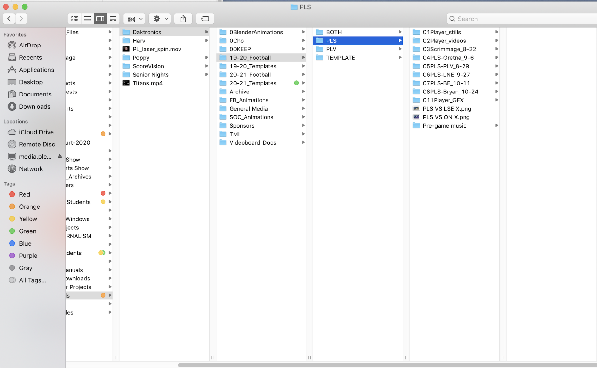
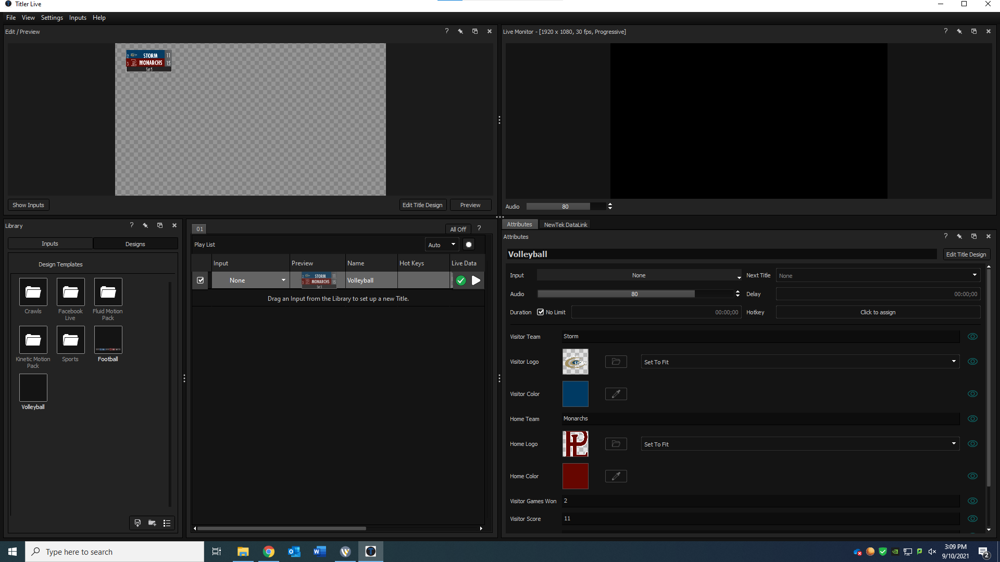

## [→ Click to View Subsections ←](headers-h.k6vpdgk5q6kp)

BOAC (Baby of all Cases)
========================

BOAC, the MOAC’s little brother, powers streams that don’t need (or can’t have) the full MOAC. It lacks a replay machine, a hub, an external switcher (though you could theoretically use it), and some of the niceties of the MOAC. It is, however, still a powerful machine, and you can easily produce a great stream with it nonetheless.

Setting up During a Stream
--------------------------

\[TODO: Pictures\]

*   Take off the front and back panels.
*   Find the power plug for Wirecast (already connected in the case), and plug it in. It should be labeled TO WIRECAST on the plug.
*   Plug in wirecast monitor and peripherals (mouse, keyboard). Don’t forget monitor power.
*   Plug in the barrel plug (power) for the switcher. It should be hanging just below its port, we unplug it so it doesn’t get crushed when we close the case.
*   Find the UPS power plug in the back, and plug it into a surge strip. It should be labeled TO WALL on the plug.
*   On the UPS (front side, bottom), open up the little clear plastic cover and press the power button. This turns BOAC on.
*   If it doesn’t start up with the UPS, turn Wirecast on (open up the front panel, flip the black switch).
*   Plug wall ethernet into the WAN1 port on the network switch.
*   Plug in ethernet for Wirecast, Switcher, and the Laptop.
    *   The cables for this should already be connected to the network switch. Simply find the loose ethernet ends and plug them into wirecast/switcher.
*   Connect the PROG SDI BNC port on the switcher (right side) to the Wirecast input BNC port (wirecast only has one BNC port, it’s that one).
*   Plug cameras into Switcher (left side, read labels).
*   Reference [Wirecast operating](h.k6vpdgk5q6kp#gfxwirecast) for Wirecast software setup.
*   Operate [Switcher on laptop](h.kwhq4y8y0apo#switcher---atem-tv-studio)

### Tearing Down

Tearing down is effectively the same as setting up but in reverse, but please keep in mind that:

*   You must unplug the power for:
    *   Switcher
    *   Wirecast (after shutting down properly from software or front panel)
*   You must disconnect the program SDI going between Switcher and Wirecast
*   You must disconnect ethernet for Wirecast

We do this so that the back case does not crush these connections when we close it.

General Layout and Case Setup
-----------------------------

Above you can see the internal connection layout of the BOAC. See [Connections](h.kwhq4y8y0apo#connections) for more information on what you need to connect.

Connections
-----------

To get the BOAC up and running, you will need to connect:

*   Network (detailed above in [Setting up During a Stream](h.kwhq4y8y0apo#setting-up-during-a-stream))
*   Cameras to Switcher
*   Power to Wirecast (we unplug this because it doesn’t fit in the case).
*   Switcher PROG OUT to Hyperdeck (this is the light blue cable coming from the top)
*   Switcher PROG OUT to Wirecast SDI In

Switcher - ATEM TV Studio
-------------------------

Everything is effectively the same as the [MOAC switcher](h.saa8t5379qfj#switcher-atem-tv-studio-pro-4k), just instead of using the physical switcher control surface you use the virtual one on the laptop.

Note that you can use the number keys to switch cameras.

* * *