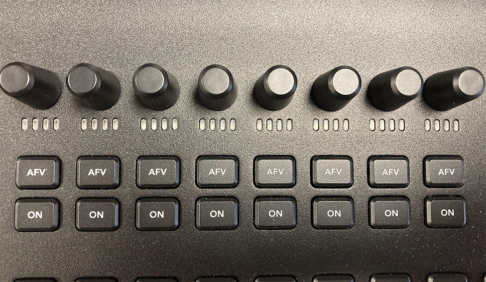
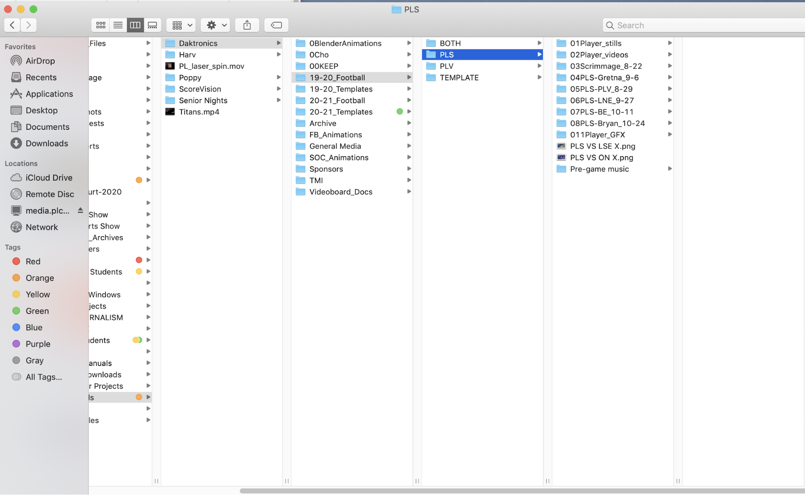
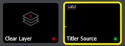

## [Click to View Subsections](headers-h.ubf5pc7fsdw4)

Daktronics Video Board (Stadium)
================================

Folder Maintenance
------------------

When you first open the video board folder in the server there’s a lot of different things to watch over and monitor. First you will see the daktronics folder. This is the one you will work in and pull things out the majority of the time. This folder its broken down into:

*   00Keep
    *   All the base animations that we use for primarily football. NEVER EVER delete this folder or its contents just in case they will need to be used in the future, but for the most part we have been moving away from using said animations so we can start to produce and use our own animations.
*   19-20\_Football
    *   In this folder you will see it broken down to both schools inside of these folders is where you will put the edited glamour shots, edited still photos, and the content throughout the year.
    *   Early in the season is a great time to knockout the preparation for each of the game folders, inside of individual game folders you should keep the updated stat graphics, the matchup graphic, special event graphics, any new animations/player videos, the ad for the week, and if one was made a highlight reel
    *   KEEP THIS FOLDER OR AT LEAST PART OF IT FOR FUTURE REFERENCE

*   19-20\_Templates
    *   This contains old examples for past stat graphics as well as a overhead shot of the stadium
    *   You will not need to use this folder except just for reference for future projects if anything
*   20-21\_Football
    *   This contains the same sort of material as the last 19-20\_football it will show you the general layout for football games and the materials you will need for each folder
*   20-21\_Templates
    *   It's the same sort of theme as the other one it contains the templates for that years stat graphics and can give you a general idea on how they should look for future years
*   GENERAL INFORMATION
    *   With those last four folders I would keep them for two years as an example and after the fall season of 21-22\_Football is complete delete the 19-20\_Football folder and repeat the process that way we can keep old examples just in case something goes wrong
*   Archive
    *   There's not a lot that you will need from this part of the folders. It's full of a bunch of the old football and soccer season stuff as well as the templates for the old 6th grade track meet which would be the only useful thing in there as it could provide for information for what to include for the meet
*   FB\_Animations
    *   This includes all the animations that were made by people in the academy it is a work in progress currently as they are not fully finished, but these should be used instead of the premade ones as we want to push our own product
    *   Any new animations relating to Football should go under this folder and replace the old ones
*   General Media
    *   In this folder it contains some of the graphics for each school that should get put in the playlist (See Event Prep Football) for each game go through and make sure graphics are up to date
    *   In this folder it also has some drone footage from 2018 that is still very good and useful for projects such as trackfest highlights (See Operation Track) in the next couple of years try and reach out to someone for with a drone to get new updated footage as it will always come in handy
*   SOC\_Animations
    *   This folder includes animations made for the soccer season these should be used instead of the premade ones (FOUND IN 00KEEP)
    *   Any new animations for Soccer should get put in this folder as well as the the project files for adjustments to be made easily
*   Sponsors
    *   This will include all of the current sponsors for the Foundation Field video board these should never be deleted unless the contract for their ad expires and then they should get put in archive for 1 year minimum that way we can always see what they used in the past
    *   In each of the folders you should see a logo used for their graphic if one was provided or made, a 15 sponsor blurb that will be put in a blurb playlist (See EVENT PREP FOOTBALL), as well as a 45 second feature ad.
    *   These ads should be checked before the beginning of each season and the foundation (SEE Event Prep Football) should be contacted before and throughout the season to make sure new ads or graphics get played and old ones archived
*   TMI (Titan Marching Invite)
    *   Within this folder there is the logos used for TMI (See Event Prep TMI) that will be used for graphics, Contact Lu Ann Kluch and Joe Homan for updated graphics and details
    *   This is also where all the graphics leading up to the event should be kept and uploaded to the DMP (See Event Prep TMI) from

*   Videoboard Docs
    *   Within this folder it includes a lot of information for creating graphics and videos for the boards it includes dimensions graphics must fall within for each zone, and video requirements such as dimensions, video format, and optimal font size
    *   There is also directions regarding the sound system and how to turn it on this can also be seen in (Event Prep Football)
*   Video Board (General)
    *   There is a few other folders under videoboard that include Harv (personal project folder), Poppy (personal project folder), Scorevision (See Scorevision Videoboard) which contains graphics and data for the gym video boards, and Senior night which will contain past years templates for senior videos as well as a place to work on future senior video projects
    *   Overall there is a bunch of very important files scattered throughout the videoboard folders if you are working on something video board related you are free to add a personal project folder under your name in the video board folder

Content Requirements
--------------------

Area Sizes:

Bottom Bar

480x53

DMP8VIDEO-1-mainLayout:bottombar

Full Screen

480x264

DMP8VIDEO-1-mainLayout:fullscreen

Input Zone

480x264

DMP8VIDEO-1-mainLayout:inputzone

Right Side Bar

96x211

DMP8VIDEO-1-mainLayout:rightsidebar

Scaled Video

384x211

DMP8VIDEO-1-mainLayout:scaledvideo

Top Section

480x264

DMP8VIDEO-1-mainLayout:topsection

  
[Link to content requirements page (Aiden Cho).](https://www.google.com/url?q=https://drive.google.com/file/d/1mgFwMxVGCxB9xtC2-X04beIh78id0cPM/view?usp%3Dsharing&sa=D&source=editors&ust=1646948582956624&usg=AOvVaw20yMrFs9zLVmHwqOrav0te)

Sound System
------------

[Link to sound system guide (Aiden Cho).](https://www.google.com/url?q=https://drive.google.com/file/d/1Ydr2btIkQWkYGC110WT6R0tfmqsi6x6q/view?usp%3Dsharing&sa=D&source=editors&ust=1646948582957334&usg=AOvVaw2tq_V7kyLW6JZZYMx2NaN_)

Event Prep
----------

If you have any questions that are urgent feel free to call Austin Tejral (402) - 208 - 3126 and I will do my best to help and answer any questions.

### Football

At the beginning of the football season there are many things to do that can be broken down into a couple categories, which include: communications, videos, sponsors, scripts and graphics.

#### Communications

*   Email setup
    
    *   Being the video board producer means that over your time in this role you will make hundreds of emails to important people and it is key that emails are properly written
        *   When writing an email always have some sort of introductory statement at the top whether that be something like Good Afternoon, Good Morning, or something more specific like Hello Mr. Hurst or just Mr. Hurst depending on the information in the message
        *   If this is your first email to someone write a introduction about who you are and the reason why you are contacting them
        *   Make sure you use correct spelling and grammar, they will not point out your mistakes, but it is a good habit to make sure things are properly typed and worded
        *   Always CC Mrs. Hoch on each email as she will be able to provide assistance in situations where you might not know the answer
    
    *   If needed ask Mrs. Hoch for the contact list and she will share the document with you if necessary
    *   Throughout the season one of your main jobs is to keep in contact with a whole bunch of people such as, sponsors, the foundation, district communications office, district IT members, athletic offices, band directors, and coaches
    *   The Foundation - they are in charge of all of the deals with our sponsors this is very important as ads will play a vital part in the flow of the script and early job operation
        *   You should contact them before the season to see if sponsors for both the video board and the banners are the same and if they intend on using the same ads as the past year
        *   You will also contact them throughout the season to have them check over the script and make sure you have the right ad for them before each game
        *   Lastly at the end of the season you will be required to put together a sponsor report (See Sponsor Report) to send or discuss with the members of the foundation (uncertain about meeting but for sure email)
    
    *   Sponsors - this will not be something you will have to do yearly the foundation will typically handle this for us, but if we are tasked to film new ads for some of the sponsors then you will be in constant contact with them throughout the entirety of the process
        *   As of March, 2021 the current sponsors are as follows: American Family Insurance, Gina V Physical Therapy, The Good Life, H & H, Hyvee, Jensen Tire, Midlands Place, Pinnacle Bank (Always the Monarch Titan Game Sponsor), Premier Family Medicine, Premier Waste Solutions, and the reader sponsor which is included in the script is mama’s pizza
        *   \[add info on duration and sponsors contracts\] \[attach image of sheet\]
    
    *   District Communications - The communications team in the district will stay informed on events happening for each game whether that be a certain ad they want played or some other event going on. They must be contacte before each game to make sure that there is nothing special. Examples of videos in the past are, Teacher of the month award videos, there’s an app for that.
    *   IT Members - Not very often will you have to contact IT to fix any issues (the most common issue being the board won’t connect to the DMP), but when you do you will typically email the helpdesk and submit a ticket and they’ll get back to you as soon as possible
        *   If it is urgent get hold of Mrs. Hoch immediately as she will be able to help and if not she can direct you to Mr. Bingham or another source of information
    
    *   Athletic Offices - This is the most important contact each week to make sure the Athletic Directors of both schools read the script for the week ex. (Monarch Home Game - Mr. Ryan, Mr. Siske; Titan Home Game - Mr. Van Ackren, Mr. Penas) Monarch Titan game both will be included and each week the athletic secretaries will be included in the emails as well Monarchs - Mr. Hoch, Titans - Mrs. Medeck
        *   Before each game there may also be more events such as senior night, homecoming, or some special sponsor (Chick-Fil-A) that we will have to make sure we have something special prepared both for the script and for a graphic on the board
        *   Also in years past we have had to do special videos for the athletic departments that they have participated in with one being My Reason Why, and another being the sportsmanship video that used to be played before the beginning of games
        *   Titans before each football game need to be contacted as they have three teacher(s) of the game that have both a spot in the script to be announced after the end of the first quarter plus a graphic that will be put up during said time
    
    *   Coaches
        *   For football, soccer, and track make sure you email them before the specified event as they will be able to add input on what they want played at said event the logos for the team and a rundown of what is to happen
        *   At track you will need a list and order of events as well as logos for the meet as different meets will sometimes have a special logo
        *   For soccer it's fairly straight forward just ask them if there is anything  extra they would like to add to the board
    
    *   Band directors
        *   At the beginning of the season bad directors from both schools will be asked for the name of their respective halftime show and a logo for it
        *   Titans have their own band announcer so we will not need to work them on an updated script each week, but we need to work on the timing of this next year, with that you will be in contact with Joe Homan, and Brian Johnson.
        *   When it comes to pregame scripting this is the hardest part to get right when it comes to working with the Titans, just stay patient with it
        *   Monarchs have a different process when it comes to their halftime show and pregame show, you will work with Joe Rohachik and Tim Keller to get the script correct
*   Throughout the season you will stay in contact with all of the people listed above and get videos from a good majority of them
    
    *   Always make sure the video has no major issues such as, black zones, frame cuts, length issues, and audio
        *   Make sure if the video is made for a specific team \[LINK H & H MONARCH AD\] it is played at a game for said team (Yes it’s been played for the rival team before)
    
    *   From the district they usually run a district ad such as there is an app for that, this in the fall will probably be replaced with a new ad, the districts video will get played 2-3 times a game
    *   There is another video you might have to run for the district that gets played once per game and it's the teacher of the month award video contact Victoria Osterley or Stacy Hawn to get those videos
    *   From the Foundation we might get new sponsors as they have contracts they may not renew, with that being said they will either provide us with those ads or we might be asked to make one for the company, if that ends up being the case you will also work very closely with the producer of the project to make sure deadlines are met so the ad can be played at the right football game
    *   Sponsors get to play their video at one football game as the main sponsor the script will get changed to fit that games featured sponsor,
        
        *   Featured sponsors will get their video played AT LEAST TWiCE per game with one time being during pregame, and the other preferably at half time
            *   You should try and play this ad more then twice as at the end of the year there will be a sponsor report for you to fill out and playing those videos more than the required amount looks good and makes the foundation and sponsors happy
                *   Do not force playing those videos more than twice though if there is time for it then do it, if not then don't feel like you have to
        
        *   Each time a feature sponsor ad, set of sponsor blurbs, stadium banner sponsor reader, or any sort of ad is played, record the time on your script. I like to write the time next to the ad on the script (ex., 6:46 next to “play sponsor blurbs” on the script) so I know which time matches with which ad.
*   At the end of a sports season, you’ll also have to make a spreadsheet or word document logging all the times sponsor ads have been played. It’ll look like this; listing which sponsor ad played when and how many times it was played at each game. You also need to include exactly which businesses
*   When it comes to the football season this is the most important job you have, the script if done properly allows the football game to run smoothly.
*   It is so important to make sure the script is well organized and that you collect the proper information for it each week
*   At the beginning of the football season you will make one from scratch that you will use as a template for the rest of the year.
*   Who’ll you need to contact for scripts-
    *   Ms DeLong handles the stadium sponsors. Email her at the beginning of the year for a list of our sponsors, and who will be featured at every game
    *   Mr. Rohacik (Monarchs), Mr. Geocke, and Mr Haselhorst (Titans), are the announcers for football. After you finish the script, send it to them so they can review and edit it if necessary.
    *   Mr. Lewandowski and Mr. Nichols are the NJROTC commanders. Make sure you have the names of who’s presenting the flags at each game. Sometimes the announcers have those names, but don’t count on them.
*   Print out 3 copies, one for the announcer(s), one for the producer, and one for you.
*   Email [1011862@plcschools.org](mailto:1011862@plcschools.org) (or [elizabethbreinholt17@gmail.com](mailto:elizabethbreinholt17@gmail.com) after the 21-22 school year as I’ll be graduating) if you want an example script sent to you. Please also ask for a list of anyone you may need to contact throughout the year.
*   As for dimensions, see above for content requirements.
*   Throughout the year, you’ll be making title cards for games (which will be added to the background playlist for each game)
    *   There’s a title card template in StreamGFX > Football > Template. It outlines what to do in the template. This can work for any sport you want to make a thumbnail of, just change the background picture if necessary.
    *   Every time I’ve opened the template, it can’t find the PLHS logo. It’s in Logos > PLHS > PL\_Logo\_trans.png
*   Get graphics for the dance team, cheer team, and band for each school. This will be in the contact list, or you can also ask Hoch or go to the school website and look under the staff directory. Allow a week or so for them to reply, and if not, just make something.
    *   This can be as simple as getting a photo from each respective group and making something simple such as just labeling the photo. THIS SHOULD BE A LAST SECOND LAST RESORT OPTION. Try everything in your power to get in contact with everyone before taking it into your own hands to make something.
*   Something else that goes along with this process is the stat graphics that must get added before the game starts to the pregame playlist, these will just cycle through the entire pregame and like I said must be updated before each game.
    *   In the past this process has been done by our announcers, but this might not be your case, if so start by navigating to maxpreps.com
    *   From there search up either Papillion La Vista or Papillion Lavista South and click on varsity football
    *   From there the headshots that we took during glamour shots will be used to make a stats graphic. There should be examples of these in some of the past folders if you need ideas.
    *   While working on the stat graphics also keep in mind what position some people play like for Quarterbacks, we won’t put on there stat graphic that they have 2 tackles, because that doesn’t pertain to their role. Instead they should have Pass Yards, Rushing yards, Total/Passing touchdowns, completion percentage, and TD/INT ratio
    *   Make Sure this at least gets done for all the starters, but if possible this should be done for all the players with stats on the team
    *   Just make sure in the end that they get proofed before the game and that they are accurate to the best of your knowledge as sometimes the stats for the week won't get put in til a little later in the week like on a wednesday.
    *   Don’t be afraid to email or talk to the coaches on when the stats will be updated as this can sometimes help remind them that it is also on them to make sure the stats get done each week.

#### Videos

#### Sponsors

*   You will stay in contact with Angie DeLong all year to make sure that the correct sponsors are being played at the right games.
*   Sponsors will get to play their video at one football game per season
*   Featured sponsors will get their video played at least twice per football game and the AD MUST BE PLAYED in its entirety or it will have to be run again, make sure to coordinate these times with AD’s, the announcers, and the band directors to ensure these are played properly.
*   You should always try to play the ad more than twice because at the end of the season it will fill out the sponsor report better and make it look good and keep the sponsors and The Foundation happy.
    *   With that being said, DO NOT FORCE the ads to be played more than twice as it leads to an awkward spot if you play it during the game when there is not enough time.

*   Other than featured sponsors, we have what we refer to as Sponsor Blurbs, these blurbs are to be played at least twice per game and the same applies as the features to try and play these more than just twice.
    *   These blurbs are to be played with no noise and are much longer than the features as they are 12 seconds for each sponsor we have so the video lasts something like three minutes so make sure to account the time to fit this in the script and schedule.

*   The last part of the sponsors we have to cover is the Stadium banner sponsors. This is just something that you add into the script for the announcer to read twice per game. You can look at past year’s scripts for the examples on how they are put into the script.

#### Scripts

#### Graphics

### TMI

\[TODO:\]

### Tater Trot

\[TODO:\]

### Soccer

\[TODO:\]

### Track

\[TODO:\]

### Unified Sports

\[TODO:\]

### 6th Grade Field Days

\[TODO:\]

### Special Events

\[TODO:\]

Operation
---------

### Football

*   Prep
    *   Most of the operations for the board are fairly similar.
    *   When you get to the stadium the first thing you want to do is go down to the field
    *   Next you will go back to the announcer booth and open the closet that's in there and inside you should see an small ground AC unit, a small wall storage thing, and most importantly the two computers that run the videoboard, one is called the vip-5000 and the other is the DMP-8000
    *   You will first turn on the VIP-5000 then, after ~3-5 minutes, (it takes a while for the VIP to properly turn on), turn on the DMP-8000
    *   During this same time you can knock out the audio portion too, in the both you will see a giant audio mixer on the cabinets, first you will turn on the white power strip that is on the cabinets to the far left of the booth if you are facing the field, next you will turn on the black power strip that is inside of the mixer it is also on the left side of the mixer if you are facing the field, then turn the mixer on with the power switch that is on the front of the mixer, next turn on all the knobs that have labels on the front to the grey dot, and finally there should be a power button next to both a wireless mic, and i'm pretty sure the other one is the Referee mic. \[add diagram\]
    *   After that return to our booth and inside there will be a computer. Use your school login to get in, after that logs you in, you should see a couple of icons \[add picture\], the ones we will focus on are display studio, and a folder icon called Content Library. If, once you log in, the wallpaper is blue, something isn’t connected. If it’s black, you should be good to go. Of course there are exceptions to this.
    *   When you click on content library it might bring you to a login page the username:vnet and the password:bowdoin-upgrade
    *   To access the PLV Media server go to the search bar in the lower left corner of the screen and type in \\\\media
    *   Then it will bring you to the videoboards server, anything that goes up on the board should get put into a folder in the Content Library folder, DO NOT just pull things from our server into the display studio.
    *   Before every game, stat graphics are updated from the team’s last game, and you need to update them. Do this by going into the background playlist button, delete all of the old stats from last week, and replace them with the current stats. This will take forever to do one at a time, so I’d recommend moving them all at once by selecting the first stat, then, holding down shift, select the last stat.
    *   How to make buttons in display studio:
        *   First, make sure you’re in the right display studio!! Monarchs and Titans football games, TMI, and other events, should be in different places.
        *   Most of the buttons should already be made for you, you just need to update them. To do this- using a player’s gif button as an example- right click on the button, hit “4”, hit the minus sign to delete their current gif, and hit the “add” button. This opens up the content library, so you can navigate to which graphic you want. You’ll use this way of replacing graphics mainly for player gifs, featured ad sponsors, and halftime stuff (bands, dance, cheer, baton teams, and anything else that may be happening during halftime). Adding graphics works the same way. You’ll mainly add graphics to existing buttons for stats (see above) and sponsor blurbs.
        *   In the event that you need to make new buttons or playlists
            *   Right click in an empty black space and click on new button
            *   This should bring up a menu with multiple tabs along the top, in this number 2

### TMI

\[TODO:\]

### Tater Trot

\[TODO:\]

### Soccer

\[TODO:\]

### Track

\[TODO:\]

### Unified Sports

\[TODO:\]

### 6th Grade Field Days

\[TODO:\]

### Special Events

\[TODO:\]