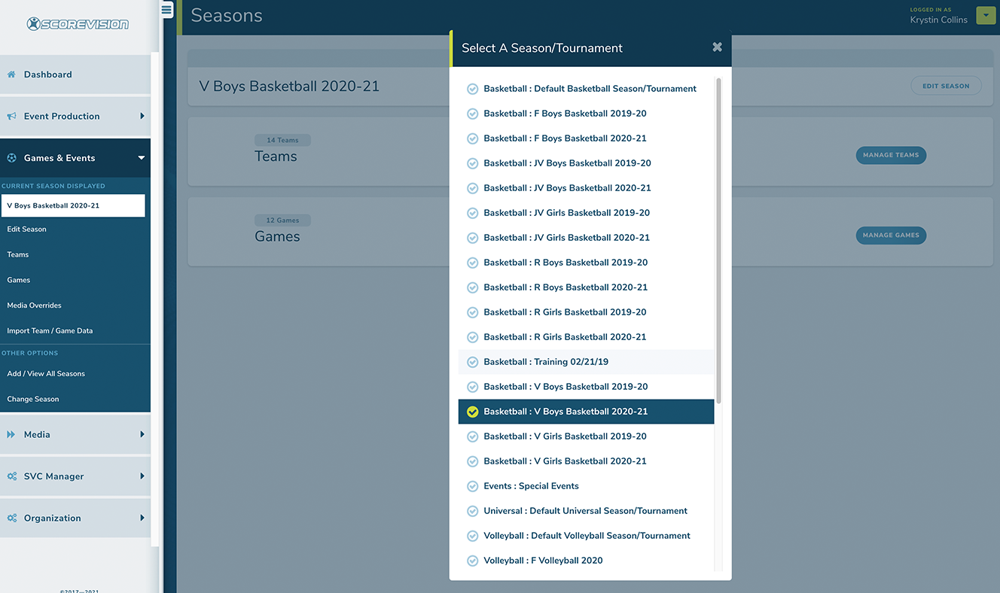
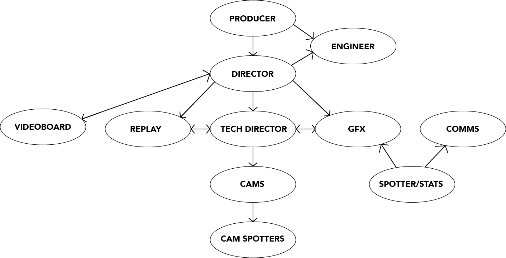

## [Click to View Subsections](headers-h.kkjzqxsoomxx)

GFX
===

The majority of this was written by me, Abigail Jensen. If you have any questions or whatever, whoever you are, even if I don’t know you, you can contact me. My phone number is 402-740-2089 and my Snapchat is graphixareece. All I ask is that you state you’re in the Media Academy and I will be free to answer any question that you have.

Want the best tip I can give you? If nothing is in here, GO TO YOUTUBE. It has helped me so much. There are so many little things that I wanted to do that I just looked up and now I use them so much. This goes for everything, not just graphics. Also, use Pinterest, Instagram, Twitter, and any social media you want for inspiration or to learn cool things. Pinterest gives you so many ideas, and I have learned so much from Instagram and Twitter. Use them to your advantage. Just follow a few accounts so you can see stuff when you scroll through your feed. Trust me, it helps so much.

Formats
-------

[See Also: Video Formats](h.kkjzqxsoomxx#formats)

JPEG/.JPG - Compressed image, not recommended for use unless you have a specific workflow reason. Used for things that are printed off; also used for YouTube thumbnails (must be 200mb or smaller).

PNG - Supports color data, is generally the standard for a high-quality export.

SVG - Vector format, meaning that the image data is stored as lines and points instead of colors, has theoretically infinite resolution.

EXR - Likely only used for blender, stores much more data about the image, with the downside of huge file sizes.

Colors
------

(Also see: [Brand Identity -> Colors](h.7bmai9pwkh9p#colors))

Monarchs HEX codes

*   Maroon: 660600
*   Gold: f5c518

Titan HEX codes

*   Blue: 003466
*   Silver: c9c9c9

PLV Media HEX codes

*   Grey: 282828
*   White: ffffff

PLCS HEX codes

*   Gold: fecb38
*   Grey: 8e8e8e

Why HEX codes? 
---------------

HEX codes use RGB (Red, Green, and Blue) to color objects. RGB uses the primary colors of light rather than pigment (that’s CMYK: cyan, magenta, yellow, and black), which is what computers and other screens use to project an image. RGB is what will be most compatible for digital graphics. Anything not printed out should use RGB/HEX color codes. In the RARE chance that you need something printed out, convert the color to CMYK. There are often issues when it comes to using CMYK online and RGB for print. Colors won’t print correctly with RGB, and colors often seem dull digitally when using CMYK. Using the proper type of color will make your job much easier.

What if I need to use other colors?
-----------------------------------

I’m not going into color theory right now you can Google that yourself. However, I will recommend you use this—[coolors.co](https://www.google.com/url?q=https://coolors.co/&sa=D&source=editors&ust=1649711188400705&usg=AOvVaw0_DjYCK-DZvtmB-5S3Lzy8). It is something you can use to create color palettes, which will in turn help your design look better. Here are two examples, with and without using a color palette.

### Without

This is okay. It’s legible, and that’s essentially what matters. However, there are ways to make it look better that don’t take much time.

### With

This is better. It was made using a color palette, so the stress of having to find a color was taken away, and it looks more appealing to the eyes. If you have trouble using color, use this. If you don’t have trouble using color, use this. It will make your stuff look so much better. Trust me. (Also don’t ask why it’s blurry. I don't know what happened and it’s really not making me look good.)

### Conclusion

I can talk about color forever, but this is essentially all you need to know to get started and make good graphics. Like I said, if you want to learn more, Google is free, and I am always open for questions.

If you want to learn more, start here:

*   [99design](https://www.google.com/url?q=https://99designs.com/blog/tips/the-7-step-guide-to-understanding-color-theory/&sa=D&source=editors&ust=1649711188401798&usg=AOvVaw08THhAXofRXbROZSRx3LZP)
*   [BlackBearDesign](https://www.google.com/url?q=https://www.blackbeardesign.com/blog/graphic-designers/understanding-color-the-meaning-of-color/&sa=D&source=editors&ust=1649711188401973&usg=AOvVaw08AuATwZ-IaNoO_YCMTNZ0)
*   [Beginning Graphic Design](https://www.google.com/url?q=https://edu.gcfglobal.org/en/beginning-graphic-design/color/1/&sa=D&source=editors&ust=1649711188402142&usg=AOvVaw30wwoi0hbwAv5b7GnvzGdA)

Illustrator 
------------

### What do you use Illustrator for?

Illustrator is software, part of the Adobe Suite, that is based on using vector graphics. In layman's terms, a vector is a graphic that you can zoom in on infinitely and it’ll never show pixels.

This is the best example of the difference between vectors and rasters that I could find:

If this manual were an Illustrator file, you could infinitely zoom in on the vector bunny and it’d never show it’s pixels (don’t try it on here, it was converted to a raster to be included here).

#### Pros of Illustrator

A great time to use Illustrator is when making a logo. You can make it as small or as big as you want, and it’ll pretty much always look good. Blowing up vectors rarely causes issues. You can also use Illustrator for layout graphics (like thumbnails, video board graphics, and anything you want in a video). You can also be as precise as you need to be with Illustrator. For anything dealing with logos, posters, any type of digital or print sign, Illustrator is where to go.

#### Cons of Illustrator

Illustrator has minimal image editing features. If you’re using an image, it’ll be hard to solely use illustrator to make your graphics. Good news is, Illustrator is very compatible with Photoshop.

In addition, unfortunately, vectors won't necessarily work with programs like Word (that’s why I had to turn that photo into a raster). According to other people, Illustrator is hard to learn and I understand completely. Don’t let that discourage you though. I personally found Illustrator to be very easy for me to use, but I struggled with Premiere. It really just depends on the person. I’m only stating this so you are aware that it may be confusing.

### What do we use Illustrator for?

We, as PLV Media, generally use Illustrator for most still graphics that we need. This includes Thumbnails, Lower Thirds, and anything for the video boards.

### Starting a Graphic

I am writing this assuming you have basic knowledge of Illustrator.

#### Creating the Document

Once you’ve opened Illustrator, you’ll be asked to create the document. From here, you can choose the number of artboards and the size of the document (plus more that shouldn’t be useful to you for most graphics you will make). Most graphics you create will probably only need one artboard, but the size varies. You can choose your own specific size, or select the preset sizes that Illustrator has. However, unless stated otherwise, you will be using 1920 x 1080 pixels, or the Web Large or HDV/HDTV 1080 preset. The preset you choose depends on how you like to use Illustrator. I prefer to use Web Large.

#### The Tool Bar

Here is what the toolbar looks like.

You can identify it on the left side of your artboard. It includes every tool that Illustrator has to offer. More tools are located under the objects with little triangles in the bottom right of the box. You can access these by holding down on the block and clicking on whatever tool you want to use. A lot of these are very similar and can be used in different scenarios or based on user preference. Use what makes you feel comfortable. I’ll give you a quick rundown of the tools that you will use the most in the academy. Once again, if you want to know how to use something that I don’t tell you, use Google or just ask me.

Here are the tools that we use the most:

The selection tool (V): Used to select objects or groups (duh), move them, size them, rotate them, the tool that you’ll use the most.

The direct selection tool (A): Essentially the selection tool, but it can be used to isolate certain paths objects even if they're within a group.

The pen tool (P): Used to make lines and create and edit anchor paths and objects. I found this confusing to learn so I would suggest playing the [Bezier Game](https://www.google.com/url?q=https://bezier.method.ac/&sa=D&source=editors&ust=1649711188404982&usg=AOvVaw1IdCTjIOhIw7EclqprzTHg) to learn how to use the pen tool. It’s easier with the pen tool to make technical and precise drawings once you really get it down. You can adjust the fill and stroke if necessary. Much better for what we do.

The curvature tool (Shift + \`  ): Much like the pen tool, the curvature tool is used to make and edit anchor paths and objects. The difference between the tool is this lacks the ability to be as precise as the pen tool. However, it is much easier to use, and much better for creative work. With the curvature tool, you click the tool once for a curve and once for a point. You can also tell what each point is by checking to see if there’s a dot in the middle of the point. If there is, it’s a pointed edge. Like the pen tool, you can adjust the fill and stroke if necessary. Not necessarily the best for what we’ll do unless you need to get creative.

The rectangle tool (M): Used to create rectangles of any size and variation. If you hold down on the rectangle tool in the toolbar you have access to the ellipse tool (L), the polygon tool, the star tool, and the line segment tool (\\). All of these are used to create their respective shapes. We often use this to create backgrounds, lower thirds, and anything that needs to have an exact shape. For all of these you can adjust the fill and stroke to what you want. Instead of using the pen tool for rectangles and circles, this is what you should use.

The paintbrush tool (B): Not something we use a lot. The tool is very simple to use and a lot like other paintbrush tools in other programs. The only time we would use this is for texture on an object. I only included it because it could be interesting to use. You can adjust the size, fill, and stroke if needed.

The text tool (T): Used to create text boxes and type in them. This is probably what we use the most out of any tool. You can change the font size, the font selection, font color, the stroke, and you can edit the text in essentially any way you can imagine.

The eraser tool (Shift + E): Used to erase points and parts of objects. Once again, I don’t think we use this much but just in case you do need to use it here you go. You can adjust the size if needed.

The eyedropper tool (I): Used to select a color from a certain object and apply it to another. You select the object you want to recolor, then use the tool to click on the object with the color desired and apply it to the other object. Pretty useful if you want to get the exact color used in a logo.

The gradient tool (G): PLEASE DO NOT OVERUSE. I use that preface because I have not only seen but made graphics with a horrendous use of gradient. That being said, it’s a pretty useful tool. It adds a little bit of dimension and makes your graphic a little more dynamic. You can select linear, radial, or freeform gradients to use. If you’re going to use it, I would suggest using subtle gradients instead of something drastic. Very useful, but could also look terrible.

The zoom tool (Z): Used to zoom in and out. You click normally to zoom in, and you opt+click to zoom out. You can also use ⌘ + to zoom in and ⌘ - to zoom out, and ⌘ 0 to go back to normal view.

### Conclusion

This has been your general overview over Adobe Illustrator. If you are wondering how to make a specific thing in Illustrator, you can check out the specific section of the manual dedicated to tutorials on how to make graphics.

Photoshop
---------

### What do you use Photoshop for?

It’s kinda in the name. Photoshop is used to adjust an image, whether it would be a photo or another graphic. Need to adjust a photo’s color? Take it to Photoshop. Need to cut out a picture of someone for a graphic? Take it to Photoshop. Need to clean up a logo that someone sent you without a single drop of empathy for how we would feel having to clean it up. You guessed it, take it to Photoshop. It’s like Illustrator, but for left-brained, analytical, methodical people. It’s more organized, but it limits creativity when it comes to creating certain graphics. The creativity with Photoshop comes when you start editing a photo.

Photoshop works in rasters ([see bunny example above](h.ndtjbu9g0o6e#illustrator)). This means that if you zoom in on the raster bunny you will eventually see pixels of different colors that make up the image. These are essentially universal to use. You can put these in word documents, in videos in Premiere, and anywhere you may need them to be.

#### Pros of Photoshop

People generally say that it’s easier to use than Illustrator, which could be true for you, or not. There’s a wide variety of things you can do when it comes to photos. There are countless photo editing tools that are extremely useful. Most of the useful tools in Photoshop are photo editing based, rather than being centered on creating graphics

. You can also use it to create graphics if you’re in a pinch and need something simple and easy to make.

#### Cons of Photoshop

There isn’t as wide of a variety when it comes to what you can do when making graphics. Graphics made in Photoshop can often look simpler than graphics made in Illustrator, which isn’t necessarily bad - it depends on what you like. I don’t know if this will make sense, but Photoshop is kinda chunkier. It’s chunky. The way that things are set up isn’t very smooth. This could help someone who needs help with symmetry and centering things, but ultimately annoys me.

Blender
-------

Want to really learn blender? Take a weekend and do the [donut tutorial](https://www.google.com/url?q=https://www.youtube.com/watch?v%3DnIoXOplUvAw%26list%3DPLjEaoINr3zgFX8ZsChQVQsuDSjEqdWMAD&sa=D&source=editors&ust=1649711188407444&usg=AOvVaw0GujBppMVKkDLOOuyKERiX).

* * *