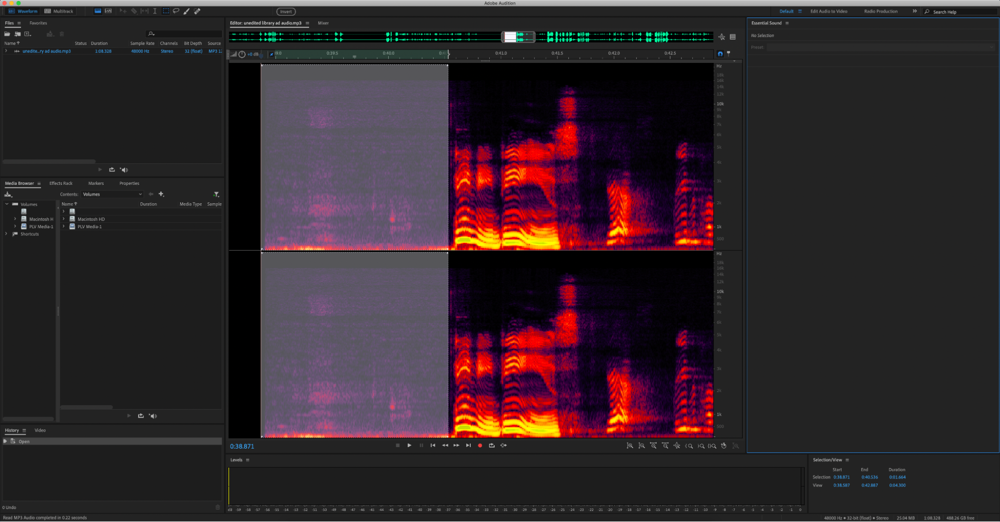
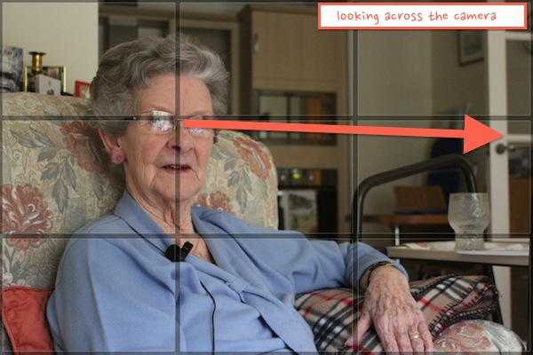

## [→ Click to View Subsections ←](headers-h.nyo502f205h5)

News Package Standards
======================

Interview Best Practices
------------------------

### Contacting your Interviewee

It’s usually best to contact your hopeful interviewee through email. Make sure to:

*   State where you’re from (Media Academy, Papillion LaVista Community Schools)
*   State what you’re doing (news package)
*   What your news package is about/why you’re asking them specifically for an interview
*   Most importantly: be respectful and professional. Use proper grammar, and format it like a business letter.

Remember, nobody owes you an interview. If someone declines, that’s ok!

If someone doesn’t respond to your email after a few days, especially/primarily students, it's ok to reach out to them in other ways to ask them to check it (e.g. having someone who knows them text them).

### Conduct

Always be professional and courteous. Never reciprocate rudeness to an interviewee, keep a cool head and be kind. Remember that the way you act before, during, and after the interview is a reflection not only of you but of the entire academy. You are asking that person to do you a favor by letting you interview them, so make sure you are kind and respectful in return.

### Rule of Thirds

Imagine the screen is split up like this:

Notice how the intersections are circled. These intersections are where you want the subject of your shot to be.

e.g.

Notice how the middle of her head lines up with the top-left third. This is how you should be framing your interviews, as it provides the most visual clarity.

Also, note the space above her head. This “headspace” is very important, you don’t want the subject’s hair clipping out of frame. If you have to have their head poking out of frame to align the middle of their nose on the third, you need to zoom out or back up!

### “Talking Space”

Using this example again:

Notice how she’s located on the left third, and is looking towards the right third. This is important! You want your subject to be looking in the direction that gives them the most space to “talk into”—you can imagine that their words take physical space, and when they speak, you want a space for those words to go. This helps keep the frame feeling balanced and clear.

Conventions for Lower Thirds
----------------------------

Lower thirds are the “name tags” for your interviewees. It tells the viewer who it is you’re interviewing, and what they do/why they’re relevant. It should include their name and

Essentially, make sure your lower third is clear and easy to read, but not distracting or “visually noisy.”