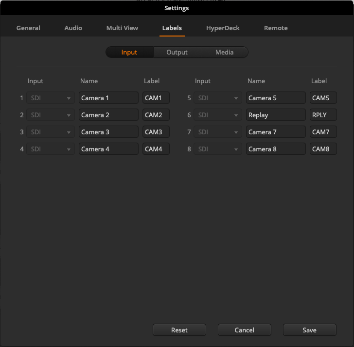
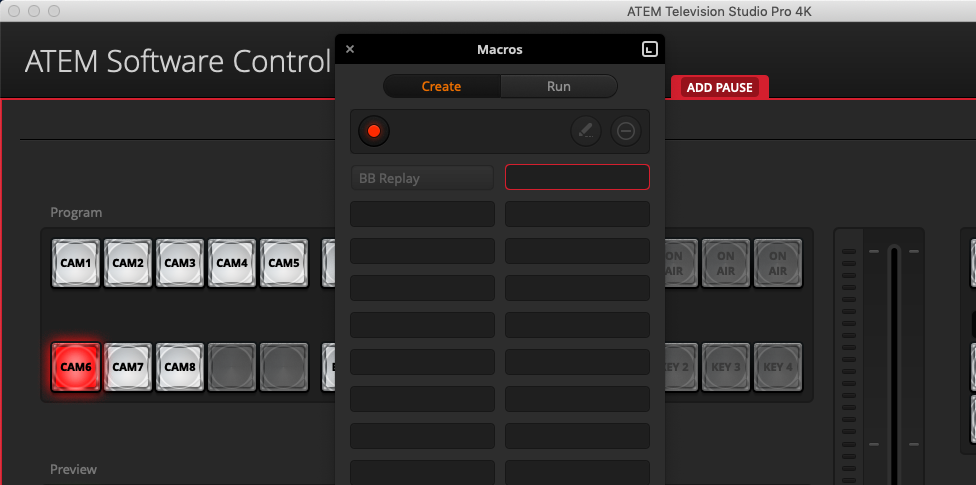

## [→ Click to View Subsections ←](headers-h.kwhq4y8y0apo)

MOAC (Mother of all Cases)
==========================

The MOAC is the heart of a stream. It handles pretty much everything, and it’s a complex beast. It’s important to get comfortable working in and around the MOAC, as you’ll be using it a lot.

Setting Up In Practice
----------------------

### Setting up monitors and stands

Take off the top panel first, and set it to the side. Unclip the side panels. If you’re at the gym, set them up as tables on the side of the MOAC, using the built-in ‘hooks’ (make sure to lock the legs). If you’re at Foundation Field, just put up one of the side panels and put the other away.

It’s up to the stream producer how they want to set it up, but effectively just ensure that you have the 2x Wirecast, 1x Replay, and 1x Switcher monitors set up in a way where replay can easily communicate with both when they plan to play their clips, and where you can easily get power and all required cables to them.

### Cables and Connections

This section is for PHYSICAL CONNECTIONS. For setting up software, scroll down past the picture to the [Getting the Computers Working](h.saa8t5379qfj#getting-the-computers-working) section.

In total, you need to wire up:

*   UPS
    *   It’s the main power cable coming out the back of the MOAC. Plug it into the wall.
*   [Network](h.saa8t5379qfj#network-switch--access-point) (Link to picture)
    *   Taking the building’s ethernet from a wall, plug it into the WAN1 port on the front.
*   Wirecast
    *   HDMI Connections are on the computer patch panel, marked in yellow as “WC”
    *   USB (mouse and keyboard) are marked on the computer patch panel.
    *   All video connections are handled through the hub. No setup or work needed.
*   Replay
    *   HDMI Connections are on the computer patch panel, marked in yellow as “RPLY”
    *   USB (mouse and keyboard) are marked on the computer patch panel.
    *   The Control Surface also plugs in through USB. (This handles power & data)
    *   All video connections are handled through the hub. No setup or work needed.
*   Switcher
    *   The control surface uses the same cord as monitors do for power.
    *   HDMI is onboard the control surface, plug it directly into the monitor.
    *   Use SDI coming from the output patch panel on the back of MOAC to plug in cameras.
    *   The SDI labeled “Program Out” on the back goes to the MOAC’s input patch panel’s “SW IN” port
*   [X32](h.saa8t5379qfj#setup) (Audio, click link for detailed setup)
    *   Connect audio to the back of the MOAC, using the audio patch panel.

You’ll also need to [turn on the UPS](h.saa8t5379qfj#turning-on).

Once everything is plugged in, ensure that everything else (replay, wirecast, X32) is turned on. If something isn’t turned on in the MOAC, open up its front panel and flip the power switch.

### Getting the Computers Working

Mainly, you’ve got:

*   Switcher + Laptop
    *   [Load in the Configuration](h.saa8t5379qfj#loading-and-saving-switcher-configuration) (if needed—in some cases you won’t have to do this)
        *   Only do this if you are using a special replay animation (which you should be doing at most sports matches)
*   Wirecast
    *   [Wirecast & Titler Setup](h.k6vpdgk5q6kp#gfxwirecast)
    *   [Wirecast Output Settings & Starting the Stream](h.k6vpdgk5q6kp#wirecast-output-settings-youtube--starting-the-stream)
*   Replay
    *   [Setting up Replay](h.saa8t5379qfj#setup---creating-a-replay-file)
*   HyperDeck
    *   [Start Recording](h.saa8t5379qfj#start-a-recording)

Once you have this finished and set up, you should be ready to start streaming!

\---

General Layout and Case Setup
-----------------------------

Going from top to bottom, the MOAC is made up of:

*   {Top Shelf}
    *   Computer Patch Panel (HDMI, USB, etc.)
    *   Power Bar
    *   [Hyperdeck](h.saa8t5379qfj#hyperdeck)
*   [The Hub](h.saa8t5379qfj#the-hub)
*   [X32](h.saa8t5379qfj#x32-audio-rack)
*   [Wirecast (+ Graphics)](h.saa8t5379qfj#wirecast)
*   [Network Switch](h.saa8t5379qfj#network-switch--access-point)
*   [Replay](h.saa8t5379qfj#replay-3play-deck)
*   Drawer
*   [UPS (Uninterruptible Power Supply)](h.saa8t5379qfj#uninterruptible-power-supply-ups)

On the backside, all you need to worry about are the [patch panels](h.saa8t5379qfj#patch-panels). 

The top patch panel (CAM1 through RPLY) is the “Camera Output” patch panel. This is the patch panel you use to get video OUT to the switcher. \[aka “Output Patch Panel”\]

The middle patch panel is the “Camera Input,” it also handles switcher program input \[aka “Input Patch Panel”\]. THIS IS THE ONE YOU PLUG CAMERAS INTO!

The bottom patch panel is the Audio Input \[aka “Audio Patch Panel”\]. This gets plugged into the commentator’s cable snake.

Peripheral to the MOAC, you have:

*   Monitors (3x)
    *   2x Wirecast
    *   1x Replay
    *   1x Switcher multiview
*   Replay Control Surface
*   The Switcher (Control Surface)
*   Switcher Laptop (plus power cord and ethernet dongle)
*   Various keyboards & mice (2x each, one for replay and one for wirecast/graphics)

Still-In-Room Testing - Checklist
---------------------------------

It’s good practice to test that the MOAC is fully functional before taking it out to the stream site.

A good checklist is:

*   Does the UPS turn on without complaints?
*   Can you connect to every display?
    *   Wirecast (+Graphics), Replay, Switcher Multicam
*   Is every connection on the patch panel solid? Can you get every camera to show up on multicam?
*   Are you getting the PROG IN video signal in wirecast?
*   Can you create a replay file? Does the replay surface work?
    *   Can you see replay on switcher multiview?
    *   Can you get every camera in?
*   Can you connect to the internet?

Patch Panels
------------

The patch panels are your main camera and audio interface for the MOAC. All of the ins and outs are labeled, so it shouldn’t be too difficult to find what you’re looking for.

As shown above, we have the “output patch panel” on TOP—this goes to the switcher and out to the commentators/other switcher monitors, and that’s it. (Don’t worry about switcher into wirecast—that’s taken care of.)

The middle patch panel is the input patch panel.

Camera inputs should go into the CAM inputs, and the switcher’s final program output goes to SW IN. Make sure you plug switcher output into the SW IN port on the right!

The final patch panel is the Audio Patch panel. This plugs into the commentator's cable snake.

Network Switch & Access Point
-----------------------------

### Stream Setup

This is super easy to set up during a stream. Simply plug wall ethernet into WAN1, as shown below.

And you’re done.

If you need to connect the switcher laptop, just use one of the three ports on the right (but don’t use the port labeled CONS).

Hyperdeck
---------

### Start a Recording

Make sure an SSD is connected. The record button is the circle in the top-middleish. Press it, and you’re good to go.

The Hub
-------

The HUB is the control center for the MOAC’s video signals. It handles routing all of the cameras into where they need to go in an easy-to-use manner.

Generally, everything is already routed for you, and during a standard stream you should never have to directly interact with the hub.

### Using the Software Interface

\[TODO:\]

### Using the Hardware Interface

\[TODO:\]

X32 Audio Rack
--------------

### Setup

First, you have to set up the commentator mics. Find:

*   The two headsets
*   The two power mutes (plus their power bricks)
*   The cable snake
*   The audio splitter cable (XLR -> Aux)

Then:

*   Plug power into the audio mutes
*   Plug the headsets into each power mute
*   Using XLR cables, take the direct out ports from the power mutes and plug them into ports 1 and 2 on the cable snake
*   Ensure the power mutes are turned on (switch on back).

To get talkback to work:

*   Take the cable splitter’s XLR end and plug it into port A on the cable snake (port A has pins instead of holes)
*   Plug either aux end of the cable splitter into each of the headsets’ aux cables.

Now, route the end of the cable snake to the back of MOAC.

Find:

*   Black cables 1 and 2 (labeled on the end of the XLR)
*   Red cable A

Plug black cables 1 and 2 into COM1 and COM2 on the back of MOAC ([audio patch panel](h.saa8t5379qfj#patch-panels)), respectively. Plug red cable A into TLKBK.

Now, you must connect the X32 to the switcher. Using two XLR cables (not the cable snake), connect SW L and SW R from the audio patch panel to the switcher’s Analog Audio In 1 & 2, in the back.

You should now be getting commentator audio in Wirecast (assuming that switcher video is being properly sent).

### Adjusting Audio Level

For COMMENTATORS:

*   On the x32 rack, use the top-left jog wheel to select the channel. (Channel mappings are labeled further to the top left)
*   Use the fader (the jog wheel below the channel select one) to increase/decrease audio level

For Ambient:

*   If you’re using ambient into x32, see above. If you’re using a camera for ambient, ensure that the camera being used has “ON” on the switcher for audio, and adjust the relevant jog wheel ON SWITCHER. See [switcher audio](h.saa8t5379qfj#audio) for more information.

Wirecast
--------

Back when Wirecast got its name, that’s all we used it for—the program Wirecast. Now, even though we still call the physical box “Wirecast,” it has multiple purposes.

You can find instructions for TitlerLive in [Wirecast operating](h.k6vpdgk5q6kp#gfxwirecast), and miscellaneous YouTube things [here](h.hhog2pau3l76#youtube).

This section is on creating templates, setting stuff up, etc.—technical details. For a regular stream, reference [Wirecast operating](h.k6vpdgk5q6kp#gfxwirecast).

\[TODO: Laura?\]

Titler
------

While physically a part of Wirecast, TitlerLive is a beast of its own.

*   Scoreboard
    *   Edit title design
    *   Creating a scoreboard
    *   Troubleshooting in titler
*   Scoreboard Controller

Switcher (ATEM TV Studio Pro 4K)
--------------------------------

If you want operational instruction, skip to the [operating](h.saa8t5379qfj#operation) section. These beginning sections deal primarily with configuration. I recommend taking a look at the [loading](h.saa8t5379qfj#loading-and-saving-switcher-configuration) instructions first though, so that you can load in the correct settings.

### Network setup and configuration

To connect ATEM setup to the switcher for configuring network settings, use a [USB 2.0 A to B](h.b016uhh7d2sk#usb-types) cable. You can then launch ATEM Setup, click on the switcher, and set network parameters (as well as device name).

As of December 2020, the network settings should be:

*   IP Address: 10.11.8.203
*   Subnet Mask: 255.255.255.0
*   Gateway: 10.11.8.254

Then, with the laptop also on the PLCS Secure network, you can launch ATEM Software Control and input the same IP Address set above to access the device.

You can also configure this from the control surface menu by going to the settings tab. (Menu button on top left, scroll using the wheel next to the screen, click “set” to select the settings tab, then scroll down to the bottom of the menu.)

[Video Example.](https://www.google.com/url?q=https://youtu.be/5j-ljKuCL10&sa=D&source=editors&ust=1662057758222826&usg=AOvVaw1rPpk0KcMh8JQ_odh_juGa)

### Loading and Saving Switcher Configuration

Most of the time, you only need to do this if you are planning on using a game-specific replay graphic. If you aren’t, you can likely ignore this and move on with the other setup steps.

To load a configuration, first, get the switcher laptop set up. On the laptop, ensure you are connected both to the [switcher](h.saa8t5379qfj#network-setup-and-configuration) and to the [server](h.f4nxr635jhly#connecting-to-the-server). In the switcher control software, go to the menu bar, select “File -> Restore” and navigate to the Switcher folder on the server. Click on one of the setup folders (i.e. Basketball, Volleyball, etc.), click on the .xml file, and click Restore.

Path: (PLV Media -> Switcher -> \[Game\] -> example.xml)

NOTE: It may take a few minutes for all media files to fully load. Be patient!

[Video example of loading](https://www.google.com/url?q=https://youtu.be/YUu5kEANvd4&sa=D&source=editors&ust=1662057758223792&usg=AOvVaw1-w4Z-8BLqGVtVaypOCcyd)

To save, simply click “File -> Save As,” and select the location to save it in. You will be presented with options of what to save, and unless if you have a specific purpose for doing otherwise, just make sure all are selected. I would recommend removing old configuration files to avoid confusion, but it is up to you what is best in your situation (at the very least, store new configurations in a sub-folder). It will take a minute or two to save.

(In the current version, as of December 2020, it will show 1% completion almost the entire time—don’t worry about that bug.)

### Configuring Switcher Multiview & Routing

In the bottom left of the ATEM Software Control panel, there’s a settings gear. Clicking on that, the main menus you care about are MultiView and Labels.

A good default setup is:

The Input number is the # SDI on the back, and the label is what will show up in multiview.

On the multiview screen, you can select the audio bars button to toggle on/off showing the audio coming from the camera (or the master audio track on program), as well as some guide lines in the preview.

(Remember, you have to click save before any changes appear in the labels menu.)

### Creating and Using Macros

In ATEM Software Control, open the macro menu from the top bar

In the window that appears, use the plus button to add a new macro. Name it, and it will begin recording.

To record a macro, simply perform the actions you wish for it to do, and then end the recording. Keep in mind, everything you do will happen immediately after the previous action, unless you manually add a pause. To add a pause, click the red “Add Pause” button in the top-middle of the switcher area—it may be hidden behind the macro panel!

The pause time is measured in \[seconds\]:\[frames\], or you can select a user wait—however if you plan to run the macro from the switcher surface and not the Software Control, I wouldn’t recommend using the “user wait” setting (Citation Needed, I just haven’t been able to find a way to advance past a User Wait on the switcher control surface). If you need functionality of this type, use two seperate macros, one being the first part of the sequence and the other being the following. (Or just use the laptop. Depends on your setup.)

### Advanced - Editing Macros After Creation

You should be particularly computer-literate, and preferably know XML, before attempting this.

To edit a macro, we have to edit our configuration file as a whole. First, [save](h.saa8t5379qfj#loading-and-saving-switcher-configuration) the configuration somewhere, and then locate it. Open it with any text editor, and find the heading <MacroPool>. It is beyond the scope of this project to detail the syntax, but the most common thing to change is time delays, and so the line for that is:

<Op id="MacroSleep" frames="\[NUMBER OF FRAMES\]"/>

You can add this in or edit the frame number at leisure. For more advanced xml editing, you can find some community documentation [here](https://www.google.com/url?q=https://github.com/imorrish/ATEMConfigSnippets&sa=D&source=editors&ust=1662057758225660&usg=AOvVaw1E-QsClBb6uirWTPVN3Pxx).

Once you [load the config back in](h.saa8t5379qfj#loading-and-saving-switcher-configuration), your macro will be edited.

### Troubleshooting

\[TODO:\]

### Operation

[\[Playlist with all operation video examples\]](https://www.google.com/url?q=https://www.youtube.com/playlist?list%3DPLDdTRHGk2-VHekl2vE2OTNvZ2PZ_qt7cS&sa=D&source=editors&ust=1662057758226227&usg=AOvVaw3w0jqjp0oULDToKq2Qopzl)

First, ensure you have the proper switcher configuration [loaded in](h.saa8t5379qfj#loading-and-saving-switcher-configuration) for the event, and all cables are connected properly. You should have power and ethernet connected first. Use the camera output patch panel (the top one) and connect all your cameras and replay (Replay goes into CAM6 on switcher).

Have the final program video output going to the input patch panel connector labeled “SW IN.”

Hopefully, now you’ll see something like this (usually with more than just the one video source):

#### Preview and Program keys (Choosing Camera)

The red row is the “Program” row—it dictates what’s directly being output.

It’s fairly self-explanatory, the button labeled “1” will be Camera 1, “2” is Cam 2, etc. All other mappings can be edited and found in [configuring routing](h.saa8t5379qfj#configuring-switcher-multiview--routing). We usually have replay mapped to “Camera 6”.

[Video example for program row.](https://www.google.com/url?q=https://youtu.be/pJGsH0jxYYk&sa=D&source=editors&ust=1662057758227073&usg=AOvVaw1UVg0s3sY5xtpuH8Y5c4zR)

If you make a mistake, it goes live immediately. If you need to quickly cut away from an injury or are just setting stuff up you may use this row, but for the most part you’re going to want to use the preview row.

With the preview row, you get a few more options. Once you click one of the buttons to view a camera, it comes up larger on the multiview for you to decide if it's worth cutting to. Once you decide to cut to a view, you can push it to live in a few ways. The most basic way, and the way you’re going to use most often, is the cut button. Pretty self-explanatory, it just cuts to whatever you have in preview.

If you want to get more fancy, we have a few options. If you want to fade, you can either click “auto” for a smooth fade or control the transition yourself using the slider bar.

[Cut Example](https://www.google.com/url?q=https://youtu.be/Rx-1buJKa1Y&sa=D&source=editors&ust=1662057758227521&usg=AOvVaw0dbRmjxNjmWa0ZbeQXsnPx)

[Fade Example](https://www.google.com/url?q=https://youtu.be/IHnbdENvH9c&sa=D&source=editors&ust=1662057758227691&usg=AOvVaw23utEH9nhE5V84b_89wfFr)

Generally, use hard cuts when there’s fast action or just a standard scene transition. You should honestly be using hard cuts a vast majority of the time.

Fades are more useful for slower events—e.g., the anthem, graduation, ceremonies, halftime (during a slow show), etc. It’s mostly up for artistic interpretation, so use your gut feelings with it!

#### Macros

Assuming that you either are using a [loaded-in](h.saa8t5379qfj#loading-and-saving-switcher-configuration) setup with a macro, or you’ve [created](h.saa8t5379qfj#creating-and-using-macros) a macro, all you have to do to trigger it from the control surface is hit the “macro” key (located at the rightmost side of the row above the program keys), and then hit its corresponding number. (On the row directly below that).

[Macro Example.](https://www.google.com/url?q=https://youtu.be/NahRnWEBVew&sa=D&source=editors&ust=1662057758228328&usg=AOvVaw1LW6gpjLlvN2-Nf64Ku_qk) (The zooming in on screens indicates that you don’t have to switch to the replay camera manually—it switches for you from whatever camera you’re already on.)

Macro 1 will usually be the replay animation, but your mileage may vary depending on what you’re streaming. Become familiar with the specific setup BEFORE the stream begins.

#### Audio

As well as handling video, the switcher control surface can level (change the volume of) and toggle (on/off) audio.

Quick rundown: If you need an audio source on, click the “on” button for its corresponding camera (cam 1 is left, cam 2 is next to it, etc.). For the rest, read on.

This is your audio panel. It has four major parts:

*   Knobs - Turn clockwise to increase audio level, turn counterclockwise to decrease
*   Indicators - Shows ROUGHLY the decibel level (loudness) of the audio source
*   AFV - Not America’s Funniest Home Videos, rather, “Audio Follow Video.” This means that whenever you have the camera selected as the program output, its audio will be on, and whenever it isn’t it will be off.
*   On - If this is lit up, the audio from this camera is coming through. If not, it’s not (unless AFV is on).

You also have an indicator on the left side of the camera’s view on the multiview screen, which has a lot more detail than just the 4 bars on the mini indicators.

Replay (3Play) Deck
-------------------

Replay is exactly what it sounds like—it’s the system we use to get replays up on screen.

### Setup - Creating a Replay File

This section assumes you have everything properly hooked up \[See: [Cables and Connections](h.saa8t5379qfj#cables-and-connections) & the above section\].

After startup, you should be on the 3Play software screen.

The session name should be the current date AND the event, and include no spaces. E.g. “Mar-25-2021\_BB-PLHS-PLS”.

All 4 cameras should be assigned to different input streams.

NOTE: If the drives are almost full, you will have to reference [Setup - Clear Drives](h.saa8t5379qfj#setup---clear-drives).

Leave session volume, video standard, and resolution default. (D:, NTSC, 1080i)

Once these are set, you can start the session.

After it loads in, assuming that you’re ready (don’t do this if the stream is still an hour or two away, that’ll just waste space, but make sure to do it when it starts), press the record button.

### Setup - Clear Drives

– HOCH OR EXPERIENCED OPERATOR ONLY –

– HOCH OR EXPERIENCED OPERATOR ONLY –

– HOCH OR EXPERIENCED OPERATOR ONLY –

You can really mess up replay if you do this wrong, so please just call in Hoch or someone who knows what they’re doing (and are properly confident in it). If you aren’t confident that you won’t break this very expensive machine, don’t do this.

Instructions are intentionally sparse, for this reason.

*   Exit to desktop
*   Using the shortcuts on the desktop for the (D:), (E:), and (F:) drives, clear the session folders.
*   Clear contents

### Operation

\[TODO:\]

Uninterruptible Power Supply (UPS)
----------------------------------

### Turning On

You press the primary power button once. It should beep. It’s on now.

### Turning Off

MAKE SURE EVERYTHING ELSE IS OFF FIRST.

Wirecast, replay, etc. all off—otherwise you could lose or corrupt data.

Then, press the primary power button, a menu appears on the screen, saying “Turn UPS off.” Press the up arrow once so it says “Yes.” Press Select.

Then, navigate to “Off-No Delay.” Select that, and it will turn off.