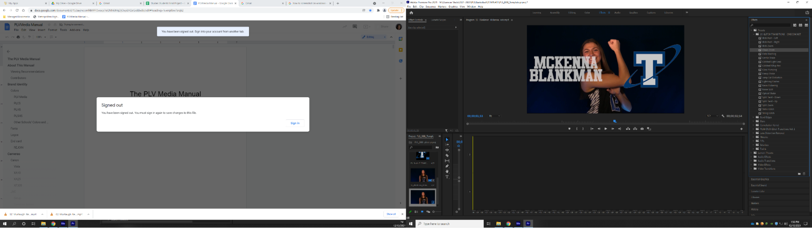
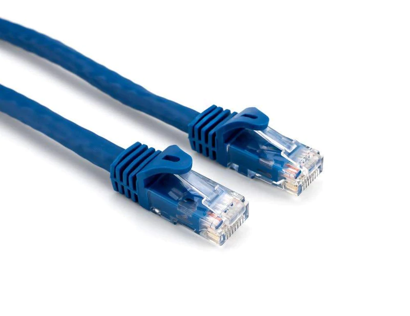
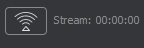

## [Click to View Subsections](headers-h.7x6bd9wj7pkn)

Glamor Shots
============

Glamor shots are the small 3-5 second GIFS we produce for the school district’s high school athletes in years past. They also tie into the photos we will use for the graphics throughout their respective seasons.

Planning
--------

### Studio Prep

*   If you are the producer please be sure to check that the studio is set up the way you would like before the start of filming.
*   I’d recommend going there with someone else the day of filming and setting it up during your class period and maybe your lunch to test the lighting with both the video camera and DSLR.-vfIt might be helpful to also remember to get the black backdrop as flat as possible as it makes the final product look cleaner.
*   When it comes to setting up the studio it is pretty straightforward as far as setting up the lights.
*   The lights should be set to the colors of the school you are filming, when setting the gels make sure that for Monarchs you set both a brown and red gel over the light to make the proper marron. For the Titans the blue gels must be doubled up to make the proper shade of the blue.
*   The lights for both schools are recommended that diffuser paper get placed over them. MAKE SURE THAT IT IS DIFFUSER PAPER and not the tissue paper that is also in the box. The diffuser paper should feel and look pretty much like wax paper. It is very different from the tissue paper that is in the box. Yet again make sure it is not the tissue paper as the tissue paper over the lights that get hot after time is a fire hazard.
*   Aside from the lamp lights that we use for the gels there should be a soft box lift that provides a nice soft white light in the studio that I recommend using.
*   With that light and the two side stand lights there is more than enough light and options to properly set up a lighting setup for your glamor shots, but it is ultimately up to the producer and Hoch of the overall setup for the glamor shots.

#### Lights

#### Camera/Tripod

*   This seems as easy as just putting the camera in there and letting it be, but it helps that when you get the camera and tripod to where you want it to be that you put tape down at the spot of the three tripod feet. This will ensure that all the shots are shot from the same position and keep some congruencey across shootings.
*   Typically in the past it's been helpful to bring in a couple of cameras into the studio when testing them out as we have had multiple instances of the camera not working properly and it led to us rushing against the clock.
*   Also from the past when doing senior videos we have hung a script with the lines the athletes are supposed to remember off the camera by taping the script to the yardstick and using tape to get the yardstick against the tripod, this just tends to help things go smoother

### Contact

*   The process of contacting is pretty simple depending on the season we are in, for the Fall the following head coaches for these sports should be contacted to plan dates, Football, Volleyball, Softball, Boys Tennis, Cross Country, and Marching band
*   YOU WILL ALWAYS INCLUDE THE AD’s, and athletic secretaries on the initial emails.
*   Spring: Baseball, Girls Tennis, Track and Field, and Soccer
*   Winter: Basketball, Wrestling, Powerlifting, Cheer and Dance (Might be Fall)
*   During the actual contacting part make sure to fill in the coaches on exactly who you want them to send whether that just be varsity or just seniors and make sure they understand
*   Also be strict with times with them and give them a certain schedule to fill as it will make life easier for you, also you are going to want to also offer make up dates to the athletes that can’t make it to the appropriate time slots
*   To make it easier I would send out a schedule to one school for one day and send out the schedule for the other school another day that way the changes of the gels will be limited making it easier on you
*   During this contact phase make sure they understand what videos their athletes will be doing whether it be senior videos, and/or GIFS. Then explain to them what they are just in case they do not know.

### Crew

*   For you crew you should have 4-5 people to properly run filming but at the very minimum you need 2-3 check operation for tasks needed filled
*   Normally you should have one person taking photos, one running videos, one person as the director, and there should be two people for pit crew
*   If you have a smaller crew I recommend there be one person in the studio running photos and videos,
*   one person as pit crew, and the producer to split between the two and help where needed

Operation
---------

### Photographer

*   Being the photographer during this process is very important and can be tricky
*   First you're gonna want to show up to filming with your producer before it starts to make sure the lighting with the DSLR looks right and not overblown, too dark, too blurry and numerous other problems that seem to happen at the worst times.
*   Typically the way the photos turn out on the DSLR are different than what we see on the JVC for videos so adjusting the lights throughout filming will probably be necessary
*   The way photos come out can also be changed from person to person and therefore lighting needs to be adjusted for that as well, but make sure you coordinate these changes with the cameraman as it will make everything much easier
*   Photos with the DSLR should be clear and crisp and you should be able to easily read the writing on their sheets that they fill out.
*   If the photos are messed up in any way, they must be rescheduled as to fix the mistakes
*   Make sure to get multiple good shots to the editors so they have photos to choose from
*   Also this tends to be an issue that comes up everytime but DO NOT SHOW THE PHOTOS it slows down the entire process and just can lead to issues

### Cameraman

*   The job of the cameraman is to make sure the flow of filming is kept at a steady pace
*   Throughout filming you should always keep an eye on the things around you make sure the lighting stays correct, monitor the audio on the senior videos, make sure the framing in all the videos is correct, make sure at the end of each of the GIFS there is no movement to end the video as it will make the final product look awkward, make sure there is always two good takes not just two takes.
*   Sometimes it takes a little bit to monitor the everything but after a few takes you should get the hang of it
*   While doing this though make sure to keep the people moving through the room at a good pace as it will keep everyone happy and make the process more enjoyable

### Director/Producer

*   You will have the most important job in this entire section because your job is to know everything in this section and be able to handle any problems that come up
*   You have the important job of making sure the photos and videos turn out right, the editing process afterwards, the scheduling of glamor shots, you need to have an decently open schedule that can adapt to changes in filming times or at least one that you can work around to get retakes done
*   Learn to email and communicate with coaches effectively to make sure things get scheduled quickly
*   DO NOT LET THEM KEEP PUTTING IT OFF, sometimes you have to be a little aggressive in the way that you need to get them to commit to a time
*   If you ever have an issue getting ahold of a coach you will go to the AD’s and explain the position that you are in, If that still does not work then make sure you work with Mrs. Hoch to get in contact of said coaches or go give them a visit yourself
*   You also have the job of managing the tasks of your crew, making sure they are aware of what they are doing and how to solve basic problems by themselves such as a dead camera or bad lighting.
*   You are also in charge of making sure you have enough sheets printed out for the participating athletes those nights

### Wrangler/Pit Crew

*   This can either be the hardest job or the easiest one depending on the group you get and how well you do your job
*   Be assertive as you are in charge of making sure everyone knows what they are doing, you are also in charge of giving them their name sheets, make sure they know the script if they are doing senior videos
*   You will also be in charge to make sure there are always enough people in the studio and getting people filtered through
*   Do not let them push you around an cut other people who have been waiting for some lame excuse just use your better judgment to get people in and out of the studio

Editing & Distribution
----------------------

### Editing Process

*   The editing process can be lengthy and stressful and the more organized it is the easier it is to get them done
*   Dividing the work up in each class to get done with the videos as soon as possible is crucial during the editing process, as the longer it takes the more people will come and ask when they will be done
*   In all honesty it is most important that the videos are done by the time of the first game of each respective sport as the GIFS will go out to the coaches before there season begin so they can put them out on social media
*   It’s important to get a template made that everyone can edit off of or recreate that way they are consistent
*   Make sure that a board is made to keep track of who is editing which video so you know who is accountable for which sports and it makes the load on one person a lot easier
*   The videos as well as the photos should all be double checked by the editor and the produce at the end of editing
*   Also editing the photos is also very important as after games we will use some of those photos to put out stat graphics for the athletes.
*   PRIORITIZE athletes who play the first games
*   To find the template go to PLV Media>Glamour Shots>TEMPLATE>2021-22
    *   Choose the template for whichever school you are editing
    *   If the teams do not have numbers (ex. wrestling) then just input the name and align it with the school logo
*   In order to use the new glitch transition you will have to install a preset into Premiere. [See this section of the guide on how to install a preset.](h.1mhv4uau4noj#installing-a-preset-into-premiere)
*   Download the ‘20 GLITCH TRANSITIONS - CINECOM.NET’ preset
*   Once you have installed the preset, cut down a section from the beginning of your footage, and the same with the end of your footage. Make sure they are relatively the same duration.
*   Open the Effects tab
*   Go to Presets
*   Go to the preset folder 20 GLITCH TRANSITIONS - CINECOM.NET
*   Import your  footage into your project if you haven’t already, and Right-click to ‘Create New Sequence from Footage’
*   Next you will copy and paste the text and logo from an already completed GIF
*   Make sure you set the duration of the text and logo to the same length of the GIF and then edit the text to be the correct name and/or number
*   After this, you will make a break at the beginning of the clip and the end of the clip. This is where you will apply the transition
*   Apply the effect “Chaos Zoom” to both cutdown sections
*   In the beginning clip, keyframe the opacity to be 0% then go to the middle of that same clip (or wherever makes the most sense) and keyframe the opacity to be 100%
*   Do the reverse action for the ending clip (Remember this will be creating a fade to black, so make sure the fade stays in time with the chaos zoom)

*   Watch it back when all effects are added and making any final adjustments
*   Export by going to File>Export>Media and exporting how you would any normal video in Premiere and set the file destination to the ‘Finished GIFs’ folder of your team
*   MAKE SURE THERE IS NO AUDIO

###   ‘Roto’ing GIFS (Rotoscoping)

*   Open Media Encoder
*   Open After Effects
*   Create New Project
*   Create New Composition
*   Copy the file name from the GIF to the Composition name
*   Confirm 1920x1080 pxl
*   Set frame rate to 59.94
*   Set resolution to full and click OK
*   File>Import>File>(choice of cutdown GIF)>Open
*   In the project window drag the video file (not the composition) down to the timeline window
*   Go to ‘Timeline’ and right-click to rename to Background
*   Do CMD+D to duplicate the layer
*   Name new layer Roto
*   With the roto layer selected, go up to ‘toolbars’ and click on Roto Tool (dude+paintbrush)
*   Double click on Roto layer with the roto tool selected
*   Draw a rough outline of the player within the body (green line)
*   Then improve the pink line by clicking and dragging (green line)
*   To remove too much roto, hold ALT+Click (red line)
*   The outline of the player is pink
*   Hit SPACE and watch for errors (Page up and down to move from frame by frame)
*   Make sure the number and all of the jersey is selected
*   Click on composition at the top of the viewer window
*   In the timeline, set Background to a 3D layer (Check “Cube Box.” You should see XYZ axes) (If the axes don’t show, hit ‘Toggle Switches/Modes” button at the bottom of the screen”
*   Go to Layer>New>Light
*   Set the light type to ‘Parallel’
*   Set the intensity to 225%
*   Change the color to the correct [hex code](https://www.google.com/url?q=https://www.color-hex.com/&sa=D&source=editors&ust=1649711188492960&usg=AOvVaw1vQMJK7XIKCruiO_9GH09I) 
*   Click OK
*   Select ‘Parallel Light’ laye by Click+Hold on the name
*   Drag between Roto and Background layer
*   Click ‘Home’
*   Hit SPACE to watch again and make any final adjustments
*   Watch again at full speed
*   Find the end of the timeline and copy the code into Composite>Settings>Duration
*   In Composite, add to Media Encoder Render Queue
*   Change file name from \_\_\_\_\_GIF to \_\_\_\_\_ROTO
*   Save file to correct location
*   Start Encoder queue
*   File>Save As in ROTO GIFs folder in After Effects

### Boxout

\[TODO\]:

### Video Board

*   After the process of editing make sure the videoboard producer is kept in the loop of the entire process as it is important that they get some of the GIFS loaded into the video board before the season begins
*   It’s also important that when they do get put on the video board that they all get tested that way any issues or mistakes that got through editing, get noticed and fixed before the next game