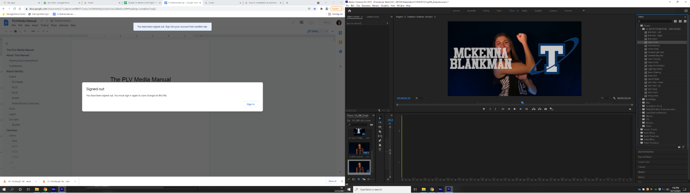

## [Click to View Subsections](headers-h.1tcdkup64r9g)

Tripods
=======

Magnus Tripods
--------------

We use these for the XA10 and XA25 cameras.

### Fixing Broken Parts

A few of the parts have a tendency to break. A few 3d-printable replacements have been made by Harv.

#### 3-Arm Connector Fix

In the toolbox, there should be a kit with a bunch of these.

If you lost that, or you’re out, the STL is in the server under “3D\_Printer\_Files -> Magnus\_Tripod\_3\_Arm\_Connector -> NEW\_Magnus\_Tripod\_Arm\_Connector\_Good\_Topo.stl”

There is a README in the same directory as the stl file, I would recommend reading that.

It can take awhile to get the old rivets off, just be patient.

#### Tension Arm Fix

In the toolbox, there should be a kit with a few of these.

If you lost that, or you’re out, the STL is in the server under “3D\_Printer\_Files -> Magnus\_Tripod\_Tension\_Arm\_Fix -> TripodHandleFix-MainBody.stl”

Unscrew it using a hex key. The back should fall out, make sure not to lose the locknut. 

You can pop the screw out by just pushing on the end, and then the metal pin should be able to come out too.

Reassembly is the same, just make sure to put the screw head in the side of the pin with the flat cutout.

It is recommended to use the heat gun to help push the pin in, it can be stubborn. You may also want to make a chamfer on the edge you’re pushing it in on to help guide it, just use a pair of pliers and spin it around in the opening.

Manfrotto Live Stream Tripods
-----------------------------

\[TODO:\]

* * *